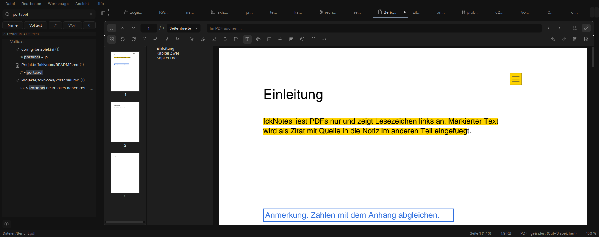
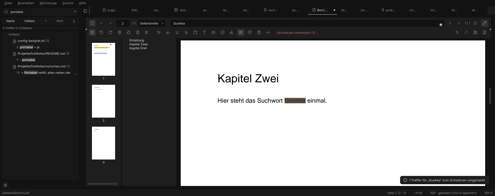
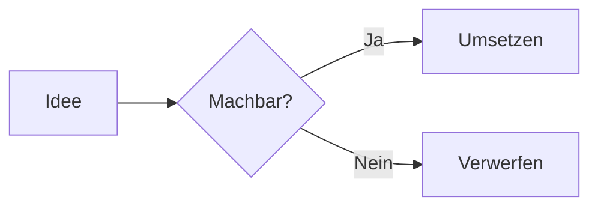

# fckNotes

> **fckNotes hieß bisher Notex.** Deine Notizen, Einstellungen und auch verschlüsselte `.ntx`-Notizen öffnen
> unverändert; wie du von einer Notex-Installation umsteigst, steht unter „Umstieg von Notex“.

Portabler Explorer + Editor für Textdateien unter Windows. Ein Ordner, eine EXE,
keine Installation: `data/` daneben ist dein Notizbaum, `config.json` merkt sich den Zustand.

## Installation

1. Aus den [Releases](https://github.com/CustomCock/fckNotes/releases) die Datei `fckNotes-vX.Y.Z.zip` laden.
2. Entpacken, z. B. nach `C:\Apps\fckNotes` oder auf einen USB-Stick.
3. `fckNotes.exe` starten. Beim ersten Start entstehen `data/` und `config.json` daneben.

Mehr ist nicht nötig. SmartScreen warnt beim ersten Start, weil die EXE nicht signiert ist:
„Weitere Informationen“ → „Trotzdem ausführen“. Die ZIP bitte komplett entpacken, nicht die
`fckNotes.exe` direkt aus dem ZIP-Fenster starten: Windows legt sie dann in einen Temp-Ordner, und
Notizen würden dort landen (fckNotes warnt in dem Fall beim Start).

**Update:** fckNotes schließen, im bestehenden Ordner `fckNotes.exe` und `_internal/` durch die aus der
neuen ZIP ersetzen (`licenses/`, `docs/`, `LICENSE`, `CHANGELOG.md` gleich mit). `data/`, `history/`,
`templates/`, `config.json`, `themes/`, `fonts/user/` und `user_dictionary.txt` bleiben liegen. Wer den Ordner verschiebt oder
neu entpackt, bekommt beim nächsten Start die Frage, ob die Windows-Dateizuordnung auf den neuen
Pfad gesetzt werden soll (auch später möglich unter Einstellungen → System → „Pfad aktualisieren“).

**Umstieg von Notex:** wie ein Update – im bestehenden Ordner `fckNotes.exe` und `_internal/` aus der neuen ZIP
ablegen und die alte `Notex.exe` löschen. `data/`, `config.json` und alles andere bleiben. War die Windows-
Dateizuordnung eingerichtet, beim ersten Start „Pfad aktualisieren“ bestätigen – dabei verschwindet auch der
alte „Notex“-Eintrag aus „Öffnen mit“.


| Start | Suche | Seitenleiste eingeklappt |
|---|---|---|
|  |  |  |

| Kontextmenü | Suchen/Ersetzen | Gespeichert-Toast |
|---|---|---|
|  |  |  |

Die Screenshots erzeugt `python tools/screenshot.py` automatisch (offscreen, mit Testdaten).
Standardschrift ist Inter; mit SF Pro in `fonts/user/` sieht die Oberfläche entsprechend anders aus.

## Was es kann

- **Verzeichnisbaum** von `data/` links, Dateien per Klick im Editor öffnen, mehrere Tabs
- **Suche** (Ctrl+Shift+F): rekursiv, case-insensitive, nach Dateiname und/oder Volltext,
  läuft im Hintergrund-Thread, Klick auf einen Treffer springt in die Zeile. Filter, Regex und
  „Ganzes Wort“ siehe [Suche und Ersetzen in Dateien](#suche-und-ersetzen-in-dateien)
- **Editor**: weißes Blatt auf dunklem Tisch, Zeilennummern, aktuelle Zeile hervorgehoben,
  Suchen/Ersetzen (Ctrl+F / Ctrl+H), Zoom (Ctrl+Mausrad, Ctrl+Plus/Minus)
- **Bearbeitungsleiste** über dem Blatt (Ctrl+Shift+E): Verlauf, Suchen, Textschrift, Ansicht,
  Zeilen- und Textwerkzeuge, Markdown-Toggles bei .md, Prüfung, Encoding/Zeilenende
- **Kein horizontales Scrollen**: Zeilen brechen immer an der Blattbreite um, auch lange URLs,
  Hashes und Pfade; Listen behalten beim Umbruch ihre Einrückung
- **Dateien**: Encoding (UTF-8, UTF-8-BOM, cp1252) und Zeilenenden (CRLF/LF) bleiben beim
  Speichern erhalten; atomares Speichern, damit bei einem Absturz nie eine halbe Datei liegt
- **Baum-Kontextmenü**: Neue Datei, Neuer Ordner, Umbenennen (F2), Papierkorb (Entf),
  Im Explorer anzeigen; Drag & Drop zum Verschieben
- **Watcher**: extern hinzugefügte Dateien tauchen im Baum auf; wird eine offene Datei
  extern geändert, fragt die App, ob sie neu laden soll
- **Dateien von außen**: Doppelklick im Explorer, Drag & Drop aufs Fenster oder Ctrl+O öffnen Dateien
  auch außerhalb von `data/` am Originalort; alle landen in EINEM Fenster (Einzelinstanz)
- **Zustand** in `config.json`: Fenster, Seitenleiste, aufgeklappte Ordner, offene Tabs,
  Zoom, Blatt-Modus, Bearbeitungsleiste, Zeilennummern, Such-Chips, Theme, zuletzt geöffnet
- **Design**: matt schwarz/grau, das Blatt weiß und zentriert (Alt+P schaltet auf volle Breite),
  ein einziger dezenter Akzent, kurze Animationen (abschaltbar unter Ansicht)

## Linux

Seit 1.4 gibt es auch einen Linux-Build: `fckNotes-vX.Y.Z-linux-x86_64.tar.gz` aus den Releases, gebaut auf
Ubuntu 22.04 (läuft auf Distributionen mit glibc ≥ 2.35, z. B. Ubuntu 22.04+, Debian 12, Fedora 36+).

```bash
tar -xzf fckNotes-v1.4.0-linux-x86_64.tar.gz -C ~/Apps
~/Apps/fckNotes/fckNotes
```

- Portabel wie unter Windows: `data/`, `config.json`, `history/`, `templates/` liegen neben der Datei `fckNotes`.
- Qt braucht auf manchen Systemen noch `libxcb-cursor0` (Ubuntu/Debian: `sudo apt install libxcb-cursor0`).
- Rechtschreibung nutzt Enchant/Hunspell des Systems, falls installiert (`libenchant-2-2`), sonst das
  eingebaute spylls mit den mitgelieferten Wörterbüchern.
- **Einstellungen → System → „Im Anwendungsmenü registrieren“** legt `notex.desktop`, den MIME-Typ für
  `.ntx` und das Icon in `~/.local/share` an – kein root, nichts systemweit. Danach steht fckNotes im Menü und
  unter „Öffnen mit“. Standardprogramm wird es nur, wenn man es selbst festlegt
  (`xdg-mime default notex.desktop text/plain`). Nach dem Verschieben des Ordners fragt fckNotes beim Start
  nach und registriert neu.
- Die Windows-Dateizuordnung, die dunkle Titelleiste und die Taskleisten-Gruppierung sind Windows-only und
  werden unter Linux übersprungen.

## Dateien von außen und Dateizuordnung

`fckNotes.exe "C:\pfad\datei.txt"` öffnet die Datei. Läuft fckNotes schon, übernimmt die laufende
Instanz sie als Tab und holt das Fenster nach vorn. Markierst du mehrere Dateien im Explorer und
drückst Enter, landen alle in einem Fenster. Dateien außerhalb von `data/` werden direkt am
Originalort bearbeitet, nicht kopiert; sie erscheinen in der Seitenleiste unter „Geöffnet“ mit
Kontextmenü „In data/ kopieren“, „In data/ verschieben“ und „Im Explorer anzeigen“. Ihre Tabs
tragen ein kleines Pfeil-Symbol. Schreibgeschützte Dateien melden sich in der Statusleiste,
Speichern bietet dann „Speichern unter …“ an. **Ctrl+R** zeigt die zuletzt geöffneten Dateien.

Damit ein Doppelklick auf `.txt` fckNotes startet, registrierst du es in den Einstellungen unter
**System**: Dateitypen wählen (.txt ist vorausgewählt), „fckNotes für Dateitypen registrieren“.
Das schreibt nur in HKCU (kein Admin) und überschreibt keine bestehende Zuordnung: fckNotes erscheint
unter „Öffnen mit“, in den Windows-Standard-Apps und im Kontextmenü als „Mit fckNotes öffnen“
(unter Windows 11 im klassischen Menü unter „Weitere Optionen anzeigen“). Den Standard für
`.txt` wählst du selbst in den Windows-Einstellungen; der Button „Windows-Standard-Apps öffnen“
bringt dich direkt dorthin. „Registrierung entfernen“ räumt alles wieder restlos weg. Wird der
fckNotes-Ordner verschoben, weist ein Hinweis beim Start darauf hin, und „Pfad aktualisieren“ schreibt
den neuen Pfad. Aus dem Dev-Modus (`python main.py`) ist die Registrierung bewusst deaktiviert.


## Quick Open und Command Palette

**Ctrl+P** öffnet ein Overlay über dem Blatt mit Fuzzy-Suche über alle Dateien in `data/` und die
zuletzt geöffneten externen Dateien: „ntz“ findet `notizen.md`, getroffene Zeichen sind
hervorgehoben, zuletzt geöffnete Dateien stehen weiter oben. `:123` springt in der aktuellen
Datei zu Zeile 123, `notizen:12` öffnet die Datei und springt. Der Dateiindex wird im Hintergrund
aufgebaut und über den Watcher aktuell gehalten.

**Ctrl+Shift+P** (oder `>` in Quick Open) zeigt alle Befehle der App mit Kategorie und Kürzel:
Menüs, Toolbar, Einstellungsseiten, Theme-Presets und Blatt-Varianten, Toggles mit aktuellem
Zustand. Zuletzt benutzte Befehle stehen oben. Neue Features melden sich an einer zentralen
Registry an und tauchen automatisch auf.

| Quick Open | Command Palette | Wiki-Links und Backlinks |
|---|---|---|
|  |  |  |

## Wiki-Links und Backlinks

In jeder Textdatei verlinkt `[[notizen]]` auf die Datei `notizen.*` irgendwo in `data/`
(Name ohne Endung, Groß-/Kleinschreibung egal; bei Mehrdeutigkeit gewinnt der kürzeste Pfad,
`[[ordner/notizen]]` zielt explizit). `[[notizen|Anzeigetext]]` zeigt anderen Text,
`[[notizen#Überschrift]]` springt zur Überschrift. Links sind im Akzent unterstrichen, kaputte
Links gestrichelt und gedämpft. **Ctrl+Klick** öffnet das Ziel; bei einem kaputten Link bietet
fckNotes an, die Datei anzulegen. Nach `[[` erscheint ein Vorschlags-Popup mit Dateien, nach `#`
mit den Überschriften der Zieldatei (Enter oder Tab übernimmt). In Codeblöcken und Inline-Code
zählen Links nicht.

**Ctrl+Shift+K** zeigt das Backlinks-Panel (unter dem Blatt oder rechts, einstellbar): alle
Dateien, die auf die aktuelle Datei verlinken, mit Zeile und Kontext, Klick springt hin.
Darunter „Unverlinkte Erwähnungen“: Stellen, an denen der Dateiname als Text vorkommt, mit
„verlinken“. Wird eine Datei oder ein Ordner umbenannt oder verschoben, fragt fckNotes „X Links in Y
Dateien anpassen?“ mit Vorschau und schreibt die Links in allen betroffenen Dateien um, auch in
offenen Tabs. Der Link-Index entsteht im Hintergrund und wird über den Watcher aktuell gehalten.

## Suche und Ersetzen in Dateien

Das Suchfeld links versteht eine kleine Abfragesprache:

| Eingabe | Bedeutung |
|---|---|
| `apfel kuchen` | beide Wörter müssen in derselben Zeile stehen (bzw. im Dateinamen) |
| `"grüne birne"` | genaue Phrase mit Leerzeichen |
| `ext:md` oder `ext:md,txt` | nur diese Endungen (auch welche, die nicht im Baum stehen) |
| `path:projekte` | nur Pfade, die „projekte“ enthalten |
| `-path:archiv` | Pfade mit „archiv“ ausschließen |

Die Chips unter dem Feld schalten **`.*`** (regulärer Ausdruck, Python-Syntax) und **Wort** (nur ganze
Wörter) zu. Eine ungültige Regex bekommt einen roten Rahmen und die Fehlermeldung als Tooltip. Jeder
Regex-Treffer hat ein Zeitlimit von 0,25 s pro Zeile, damit ein Muster wie `(a|a)+$` fckNotes nicht
einfriert; die Suche bricht dann mit „Timeout“ ab.

**Ctrl+Shift+H** öffnet „Ersetzen in Dateien“: gleicher Suchbegriff, Ersatztext (bei Regex mit `\1` für
Gruppen), darunter jede betroffene Zeile als *vorher → nachher* mit Häkchen. Ersetzt wird nur, was
angekreuzt ist. Offene Dateien mit ungespeicherten Änderungen werden im Editor ersetzt (rückgängig
machbar, nicht gespeichert), offene gespeicherte Dateien werden danach gespeichert, alle anderen
atomar mit ihrem Encoding und Zeilenende geschrieben.


## Versionsverlauf

Jedes Speichern legt einen Schnappschuss in `history/` neben der App ab (komprimiert, gleiche Inhalte
nur einmal). Auch das Öffnen, Neuladen nach externer Änderung, „Ersetzen in Dateien“ und das
Anpassen von Links sichern den vorherigen Stand. **Ctrl+Shift+Y** zeigt die Versionen der aktuellen
Datei mit farbigem Diff zum aktuellen Text; „Wiederherstellen“ ersetzt den Editor-Text als ein
Undo-Schritt und speichert nicht.

- Umbenennen und Verschieben im Baum nehmen den Verlauf mit.
- Ausdünnung: 24 h alles, bis 7 Tage stündlich, bis 30 Tage täglich, bis 1 Jahr wöchentlich, danach
  monatlich; die neueste Version bleibt immer.
- Obergrenze (Standard 200 MB) und „Verlauf leeren“ unter Einstellungen → Editor.
- Verschlüsselte Notizen (`.ntx`) bekommen nie einen Verlauf, externe Dateien außerhalb von `data/`
  ebenfalls nicht.


## Vorlagen und „Neue Woche“

Vorlagen sind `.md`-, `.txt`-, `.csv`- oder `.yar`-Dateien in `templates/` neben der App. Beim ersten Benutzen
legt fckNotes die mitgelieferten an (Woche, Tagesnotiz, Besprechung, E-Mail- und Tabellen-Vorlagen …).
**Ctrl+Shift+T** öffnet die Vorlagen-Auswahl und erzeugt die neue Datei im gewählten Ordner.

Die Auswahl zeigt die Vorlagen **nach Kategorien in Abschnitten**, darin alphabetisch: Ausbildung,
Kunde/Einsatz, E-Mail, Tabellen, Planung & Notizen, Sicherheit & Forensik, Sonstiges. Das **Suchfeld** filtert
nach Name und Kategorie (`mail termin`, `ausbildung`, `tabellen`); Enter nimmt den ersten Treffer. Die
**Fragebögen** stehen mit in der Liste – z. B. das **Berichtsheft** (Ausbildungsnachweis) unter „Ausbildung“ – und
starten beim Auswählen den Assistenten. Eigene Ordnung: ein **Unterordner** in `templates/` wird zur Kategorie
(`templates/Kunde X/Protokoll.md` → Abschnitt „Kunde X“); Fragebögen können `category:` im YAML angeben. Dateien
werden für die Einordnung nie verschoben. Jede Datei-Vorlage steht auch als „Vorlage: Kategorie › Name“ in der
Command Palette.

| Platzhalter | Ergebnis |
|---|---|
| `{{date}}` / `{{date:%Y-%m-%d}}` | 26.09.2026 / beliebiges strftime-Format |
| `{{time}}` | 14:05 |
| `{{weekday}}` | Samstag |
| `{{week}}` / `{{year}}` | ISO-Kalenderwoche (zweistellig) / Jahr (mit `{{week}}` das ISO-Jahr) |
| `{{title}}` | Name der neuen Datei ohne Endung |
| `{{cursor}}` | hier steht der Cursor danach |
| `{{date+1}}`, `{{weekday+2}}` | Tagesversatz, z. B. für Wochenpläne |

**Alt+W** („Neue Woche“) legt in `data/Wochen/` den Plan der aktuellen ISO-Woche an, z. B.
`KW39 2026.md` mit Montag bis Freitag samt Datum; gibt es ihn schon, wird er geöffnet. „Nächste Woche
anlegen“ steht im Menü Datei. Ordner, Dateiname und Vorlage stellt man unter Einstellungen → Editor ein.


## Bilder

- **Einfügen:** Ctrl+V mit einem Bild in der Zwischenablage (z. B. Screenshot) oder Bilddateien auf eine
  `.md` ziehen: fckNotes legt das Bild als Datei in `assets/` neben der Notiz ab (Name aus Notizname und
  Zeitstempel, Ordnername in Einstellungen → Editor) und fügt `` am Cursor ein. In
  verschlüsselte Notizen (`.ntx`) werden keine Bilder eingefügt – das Bild läge sonst unverschlüsselt daneben.
- **Anzeigen:** `.png .jpg .jpeg .gif .webp .bmp .svg` erscheinen im Baum und öffnen in einem Bild-Tab:
  Einpassen oder 100 %, Zoom mit dem Mausrad, Verschieben mit gedrückter Maus, dunkler neutraler Hintergrund.
  Maße, Dateigröße, Format und Zoom stehen in der Statusleiste.
- **Verschieben:** Wandert eine Notiz in einen anderen Ordner, fragt fckNotes, ob ihre Bilder aus `assets/`
  mitkommen; Links werden angepasst, Bilder, die andere Notizen im alten Ordner auch nutzen, werden kopiert.
- **Aufräumen:** „Unbenutzte Bilder finden …“ (Menü Datei, Command Palette) listet Bilder ohne Verweis mit
  Vorschau; nur Angekreuztes kommt in den Papierkorb. Gelöscht wird nie automatisch.


## Werkzeuge, Explorer und Export

| Explorer mit Orten | Werkzeug-Übersicht | Allgemeine Log-Auswertung |
|---|---|---|
|  |  |  |

**Menü „Werkzeuge“** (neben „Bearbeiten“) sammelt alle Werkzeuge nach Kategorie: Dateianalyse, Netzwerk,
Logs & Vorfälle, Text & Daten, Dokumentation. Werkzeuge, die nicht zur aktuellen Datei passen, sind ausgegraut
(der Tooltip erklärt warum); Werkzeuge abgeschalteter Module erscheinen gar nicht. Die **Werkzeug-Übersicht**
(`Ctrl+Shift+W`, auch in der Palette) ist ein durchsuchbarer Katalog mit Kurzbeschreibung, Kürzel und Modul-Status –
je Kachel „Starten“ oder, wenn das Modul aus ist, „Aktivieren“. In der Blatt-Leiste gibt es einen „Werkzeuge“-Button
und im Datei-Baum ein Kontextmenü „Werkzeuge“ (jeweils nur die passenden).

**Explorer mit Orten:** Über dem Datei-Baum stehen drei Orte. **Notizen** ist der Datenordner (`data/`).
**Schnellzugriff** sind selbst angeheftete Ordner (Rechtsklick auf einen Ordner → „An Schnellzugriff anheften“).
**Dieser PC** zeigt den persönlichen Ordner und die Laufwerke/Wurzeln – so lassen sich beliebige Dateien auf dem
Rechner öffnen und mit den Werkzeugen untersuchen. Ein Klick auf einen Ort schaltet den Baum um. Versteckte Dateien
blendet das Kontextmenü ein. Außerhalb des Notiz-Ordners warnt fckNotes vor Schreibzugriffen, in Systemordnern besonders
deutlich – gelesen wird nie automatisch.

**Neue Datei nach Typ** (Menü Datei bzw. Baum-Kontextmenü, je Typ auch in der Palette) legt Text, Markdown, CSV, JSON,
YAML, HTML, Python, Shell oder INI mit passendem Startinhalt an; das Zeilenende (LF/CRLF) ist wählbar und wird gemerkt.

**Export** (Datei → Exportieren, auch in der Palette) schreibt die aktuelle Notiz als **PDF** oder **HTML**. Markdown
wird gerendert, CSV als Tabelle, sonst als Text; Variablen (`§name`) werden aufgelöst. Das PDF bekommt je Seite eine
Kopfzeile (Logo, Titel, Autor/Datum) und eine Fußzeile (Seite X von Y), das HTML ist ein eigenständiges Dokument mit
eingebettetem Logo. Der Klartext einer verschlüsselten Notiz (.ntx) wird nur nach ausdrücklicher Rückfrage exportiert.

## Formatierte Bearbeitung, Fragebögen und Vorlagen

| Formatierte Bearbeitung (WYSIWYG) | Fragebogen-Assistent |
|---|---|
|  |  |

**Formatiert bearbeiten (WYSIWYG):** Rechtsklick auf eine `.md`-Notiz → „Formatiert bearbeiten …“ (auch in der
Palette). `**fett**` erscheint als **fett** und wird als fetter Text bearbeitet – keine Sternchen im Blick. Die
Symbolleiste und Kürzel (Ctrl+B/I, Überschriften, Listen, Aufgaben, Zitat, Trennlinie, Link) formatieren; oben rechts
schaltet **Formatiert | Quelltext (Markdown)** um. Unter der Haube bleibt Markdown; Variablen (`§name`) bleiben in
beiden Ansichten erhalten. Tabellen und Codeblöcke werden formatiert gezeigt – Feinarbeit an ihnen am besten in der
Quelltext-Ansicht.

**Fragebögen ausfüllen:** Datei → „Fragebogen ausfüllen …“ (oder Palette) öffnet einen Assistenten (ein Abschnitt pro
Seite, Fortschritt, Zurück/Weiter, Zwischenstand gemerkt). Das Ergebnis wird als formatierte Notiz gespeichert
(Antworten im Frontmatter, später erneut ausfüllbar). Mitgeliefert:

- **Ausbildungsnachweis/Berichtsheft** – optional **aus einem Kalender-Export (.ics)** vorbefüllt
  („Berichtsheft aus Kalender (.ics) …“): die Termine der gewählten Woche werden zu Tages-Tätigkeiten mit Dauer.
- **Systemcheck beim Kunden** – Checkliste mit Befunden und Empfehlungen.
- **Sicherheits-Check** für kleine Unternehmen – mit **Auswertung** (Punkte je Bereich, Ampel, Gesamtbewertung).

Eigene Fragebögen sind einfache YAML-Dateien in `templates/fragebogen/`:

```yaml
id: mein-check
title: Mein Check
sections:
  - id: allgemein
    title: Allgemein
    questions:
      - {id: name, type: text, label: "Name", required: true}
      - {id: ok, type: yesno, weight: 2, label: "Läuft alles?"}
      - id: details
        type: text
        label: "Details"
        when: {question: ok, equals: Nein}   # nur zeigen, wenn oben „Nein"
```

Fragetypen: `text`, `yesno`, `choice`, `multichoice`, `number`, `date`, `time`, `table`. Mit `options` (auch mit
`score` für die Auswertung), `when` (Bedingung), `weight`, `help`, `chips` und einer optionalen `output`-Vorlage
(`{{fragen-id}}`).

**E-Mail- und Tabellen-Vorlagen** liegen unter „Neue Datei aus Vorlage“ bereit (E-Mail: Betreff als erste Zeile, ohne
Grußformel/Signatur; Tabellen als CSV/Markdown, Benutzerlisten bewusst **ohne Passwortspalte**).

## Analyse per Rechtsklick

Text markieren (oder mit dem Cursor auf einem Wort stehen) und rechtsklicken → Gruppe **Analysieren**. fckNotes erkennt
den Typ der Markierung und bietet nur die passenden Aktionen; das Ergebnis erscheint in einer kompakten Karte neben
der Markierung. Dieselben Aktionen stehen auch in der Command Palette („Analysieren: …“). Aktionen abgeschalteter
Module erscheinen als „… – Modul aktivieren“.


| Erkannter Typ | Aktionen |
|---|---|
| IPv4 / IPv6 / Domain | DNS auflösen (A/AAAA/PTR), Ping, gängige Ports prüfen, Port nachschlagen, RDAP/ASN, in IP-Übersicht/Scanner öffnen |
| CIDR (z. B. `10.0.0.0/24`) | im Netzwerk-Scanner öffnen |
| Port (`443/tcp`, `host:443`) | Port nachschlagen (IANA + gängige Dienste, offline) |
| Hash (MD5/SHA-1/256/512, NTLM, bcrypt/argon2/…) | **Hash-Info**: Typ erkennen, Online-Lookup (nur ungesalzen) |
| Base64 / Base32 / Hex / URL | dekodieren (Binärergebnis als Hex) |
| JWT | Header/Payload als JSON, Zeiten lesbar (Signatur **nicht** geprüft) |
| Unix-Zeit / ISO-Datum | Zeitstempel ↔ Datum (UTC + lokal) |
| Zahl (dez/hex/bin) | in allen Basen + Bit-Ansicht |
| Hex-Farbe (`#1e1e1e`) | Farbvorschau + RGB |
| CVE-ID | im Browser bei der NVD nachschlagen |
| User-Agent | in Browser / System / Gerät zerlegen |
| jedes Wort | „Hash dieses Worts bilden“ (MD5/SHA-1/SHA-256/NTLM, lokal) |

**Hash ist nicht Verschlüsselung.** Ein Hash ist eine Einwegfunktion – er lässt sich nicht „entschlüsseln“. „Hash-Info“
schlägt einen Hash höchstens in einer öffentlichen Datenbank nach (ob der Klartext eines bekannten Passworts vorliegt).
Das geht nur bei **ungesalzenen** Hashes; gesalzene Formate (bcrypt, argon2, sha512crypt …) sind sinnlos abzufragen und
der Knopf bleibt deaktiviert. Der Online-Lookup ist standardmäßig aus (Einstellungen → **Analyse**), fragt vor dem
ersten Senden nach und ist aus verschlüsselten Notizen (.ntx) gesperrt. Bewusst **keine** mitgelieferte Wortliste und
**keine** Rainbow-Tables – Offline-Cracking ist Aufgabe eigener Werkzeuge wie hashcat oder John the Ripper.

## Module

Einstellungen → **Module** (`Ctrl+,`, oder „Einstellungen: Module“ in der Command Palette) schaltet Funktionen
einzeln an und aus – sofort, ohne Neustart. Ein ausgeschaltetes Modul hat keine Menüeinträge, Befehle,
Tastenkürzel, Panels, Hover oder Hintergrundarbeit und lädt seine Bibliotheken nicht.

Ganz oben stehen **„Alle Module“** (Tri-State: an / teils / aus – ein Klick schaltet alle an bzw. aus) sowie die
Knöpfe **Alle aktivieren** und **Alle deaktivieren** mit Zähler („12 von 15 aktiv“). Auch das wirkt sofort und wird
gespeichert; „Abbrechen“ im Einstellungsdialog stellt den vorherigen Zustand wieder her. In der Command Palette:
„Module: alle aktivieren“ / „Module: alle deaktivieren“.

| Modul | Standard | Zusätzlich nötig |
|---|---|---|
| Variablen | an | – |
| Hex & Dateianalyse (Hex-Ansicht, Dateityp, Prüfsummen) | an | – |
| Strings, Eingebettete Dateien, Entropie | aus | – |
| Metadaten | aus | pypdf (gebündelt) |
| YARA | aus | yara-python (gebündelt) |
| Zeitleiste & Beweismittel | aus | – |
| IOC entschärfen | an | – |
| Port-Infos | an | – |
| IP-Konflikte | aus | – |
| RDAP/ASN | aus | Netzwerk (nur auf Klick) |
| Netzwerk-Scanner | aus | – |
| Log-Auswertung | aus | evtx (gebündelt, nur für .evtx) |
| PCAP-Übersicht | aus | dpkt (gebündelt) |

Module, die noch nicht umgesetzt sind, stehen mit „folgt in Block …“ in der Liste. Ist „Hex & Dateianalyse“ aus,
öffnen Binärdateien wieder im Texteditor.

Der Baum zeigt normalerweise nur die eingestellten Dateiendungen (Einstellungen → Editor → Baum). Solange eines der
Analyse-Module Strings, Eingebettete Dateien, Entropie oder Metadaten an ist, zeigt er **alle Dateien** – damit sich auch
`.exe`, `.zip` oder `.pcap` per Rechtsklick untersuchen lassen. Dauerhaft geht das über „Alle Dateien anzeigen“.


## Variablen

Textbausteine mit Verknüpfung (Modul „Variablen“, Standard an). Einstellungen → **Variablen** (`Ctrl+Shift+Alt+V`):
Tabelle mit Name, Wert (auch mehrzeilig) und Beschreibung, Suche, Import/Export als JSON. Gespeichert wird in
`variables.json` neben der App – **unverschlüsselt, also keine Passwörter oder Geheimnisse als Variablen**.

- Schreibst du `§gruss`, steht in der Datei genau das. fckNotes zeigt im Editor den **Wert** im Lesefluss (dezent
  hinterlegt); Hover zeigt Name und Wert. Ändert sich ein Wert, ändert sich die Anzeige überall sofort.
- Namen: Buchstaben (auch Umlaute), Ziffern, Unterstrich – z. B. `§23`, `§gruss`, `§firma_tel`. Das Token endet am
  ersten anderen Zeichen und zählt nur, wenn genau dieser Name definiert ist (`§23a` bleibt normaler Text, `§234`
  ist §234 und nicht §23 + „4“). Nicht definierte Tokens sind normaler Text. Präfix einstellbar (Standard `§`).
- Die Variable verhält sich wie **ein Zeichen**: Pfeiltasten springen darüber, Entf/Rücktaste löschen sie ganz.
- Nach dem Präfix schlägt fckNotes passende Variablen vor (Enter übernimmt, Esc lässt den Text, wie er ist);
  `Ctrl+Alt+V` fügt das Präfix ein und öffnet die Vorschläge.
- **Rechtsklick** auf eine Variable: „Variable entfernen (als normalen Text behalten)“ – gespeichert als `\§23`,
  angezeigt als normales „§23“ –, „Durch Wert ersetzen“, „Variable bearbeiten …“. Auf einem entfernten Vorkommen:
  „Wieder als Variable verwenden“. Palette: „Alle Variablen in dieser Datei durch Werte ersetzen“, „Variablen in
  Auswahl entfernen“. Alles mit Undo.
- `Ctrl+C` kopiert die Werte (einstellbar: Werte oder Tokens). Die Markdown-Vorschau zeigt Werte, entfernte
  Vorkommen als normales §name. Die Rechtschreibprüfung ignoriert Tokens.
- Die Volltextsuche findet Tokens; der Chip „§“ sucht zusätzlich in den Werten.
- Keine Rekursion: Variablen in Variablenwerten werden nicht aufgelöst. Funktioniert in allen Textdateien, auch in
  `.ntx` (aufgelöst wird nur im Speicher). Ist das Modul aus, erscheinen Tokens als normaler Text; Dateien bleiben
  unverändert – auch bloßes Öffnen und Speichern ändert kein Byte.

| Im Editor | Vorschläge | Verwalten |
|---|---|---|
|  |  |  |


## CSV als Tabelle

`.csv`- und `.tsv`-Dateien lassen sich mit `Ctrl+Shift+V` (oder „CSV/TSV: Als Tabelle anzeigen“ in der Command
Palette) zwischen **Text** und **Tabelle** umschalten – der Zustand gilt pro Tab. Einstellungen → Editor →
Datenformate öffnet CSV/TSV auf Wunsch direkt als Tabelle.

- **Erkennung:** Trennzeichen (Komma, Semikolon, Tab, senkrechter Strich), Anführungszeichen-Stil und Encoding
  werden automatisch erkannt; alles lässt sich in der Leiste über der Tabelle überschreiben. Ein anderes Encoding
  liest die Datei neu (UTF-8, UTF-8 BOM, cp1252, ISO-8859-1, UTF-16).
- **Ansicht:** Kopfzeile ein/aus, Klick auf eine Spalte sortiert (Zahlen numerisch, auch `1.234,56`), Filterfeld
  (`Ctrl+F`) sucht in allen Spalten, Spaltenbreiten ziehbar, Zeilennummern links zeigen die Zeile in der Datei.
  Sortieren und Filtern ändern nur die Ansicht, nie die Reihenfolge in der Datei.
- **Bearbeiten:** Doppelklick/F2 bearbeitet eine Zelle, Zeilen und Spalten einfügen/löschen über die Leiste,
  `Ctrl+C`/`Ctrl+V` kopieren/fügen Tab-getrennte Blöcke (wie aus einer Tabellenkalkulation), `Entf` leert Zellen.
- **Speichern** schreibt die Tabelle im erkannten Stil zurück: gleiches Trennzeichen, gleicher Quoting-Stil,
  gleiches Encoding, gleiche Zeilenenden (CRLF/LF). Solange nichts geändert wurde, bleibt die Datei unangetastet.
- Große Dateien (100 000 Zeilen) laufen über ein Tabellenmodell, das nur sichtbare Zellen zeichnet.
- Verschlüsselte Notizen (`.ntx`) bekommen keine Tabellenansicht.


## JSON und YAML

Für `.json` und `.yaml`/`.yml` (Menü Bearbeiten → JSON/YAML oder Command Palette):

- **Formatieren** (`Shift+Alt+F`) rückt neu ein (Einrückung in Einstellungen → Editor → Datenformate).
  JSON wird token-basiert formatiert: Zahlen (`1.10`, `1e5`), Escapes und die Reihenfolge der Schlüssel bleiben
  exakt erhalten, nur der Leerraum ändert sich. **Minimieren** (`Shift+Alt+M`) schreibt alles in eine Zeile.
  Beides ist ein einziger Rückgängig-Schritt.
- **Prüfen** (`Shift+Alt+V`) – und automatisch beim Tippen (bis 2 MB): Fehler erscheinen mit Zeile und Spalte rechts
  in der Statusleiste (Klick springt hin) und als rote Wellenlinie im Text.
- **Baumansicht** (`Ctrl+Shift+V` schaltet Text ↔ Baum): Schlüssel, Wert, Typ; der Pfad der Auswahl steht oben
  (z. B. `$.users[3].name`) und lässt sich mit „Pfad kopieren“ übernehmen. Kinder werden erst beim Aufklappen
  erzeugt, große Dateien bleiben flüssig. Bei ungültigem Inhalt zeigt der Baum den Fehler mit „Zur Stelle springen“.
- **YAML** wird ausschließlich sicher gelesen und geschrieben (`safe_load`/`safe_dump` – keine Python-Objekte, kein
  Code). Beim Formatieren gehen Kommentare und Anker verloren; enthält die Datei Kommentare, fragt fckNotes vorher.
- Verschlüsselte Notizen (`.ntx`) haben keine Baumansicht und keine Prüfung beim Tippen.

| Baum | Fehler |
|---|---|
|  |  |


## PDF

PDFs öffnen als eigener Tab – zum Lesen und, mit dem **Stift** rechts oben, zum Bearbeiten:

- Scrollen, Zoom (Seitenbreite, ganze Seite, 50–300 %, `Ctrl+Mausrad`, `Ctrl+Plus/Minus`), Seite springen
  (`Ctrl+G`, auch Seitenbezeichnungen wie „iv“), Textsuche mit Trefferzähler (`Ctrl+F`, `F3`/`Shift+F3`),
  Lesezeichen-Leiste (erscheint automatisch, wenn das PDF welche hat).
- **Text markieren** mit der Maus (rastet auf Textzeilen ein, Doppelklick = Wort, `Ctrl+A` = ganze Seite), `Ctrl+C`
  kopiert. **„Als Zitat in Notiz einfügen“** (Knopf oder Rechtsklick) schreibt den Text als Markdown-Zitat mit
  Quelle in die Notiz, die im **anderen Teil der geteilten Ansicht** aktiv ist:

  ```markdown
  > Der markierte Text …
  >
  > — *Bericht.pdf*, S. 3
  ```

  Ohne Teilung landet das Zitat in der Zwischenablage. Teilen geht jetzt auch aus einem PDF-Tab heraus (`Ctrl+\`).
- Keine Skripte, keine Link-Aktionen. Die Datei wird in den Speicher gelesen und gleich wieder geschlossen –
  umbenennen/verschieben geht auch, während der Tab offen ist. Passwortgeschützte PDFs fragen nach dem Passwort (es
  wird nirgends gespeichert) und lassen sich nur ansehen, nicht bearbeiten.
- Technik: QtPdf (PDFium) zum Anzeigen, pypdf zum Bearbeiten; ohne QtWebEngine.


### PDF bearbeiten

Der Stift schaltet eine zweite Leiste und die **Seitenleiste** (Miniaturen) ein. Alles passiert erst im Speicher:
`Ctrl+Z`/`Ctrl+Y` machen jeden Schritt rückgängig, der Tab zeigt „●“, und erst `Ctrl+S` schreibt die Datei
(`Ctrl+Shift+Alt+S` = Speichern unter). Vor dem ersten Überschreiben legt fckNotes das alte PDF in den Papierkorb
(abschaltbar unter Einstellungen › Editor › PDF bearbeiten) – der Versionsverlauf gilt nur für Textdateien.

**Seiten organisieren** – in der Seitenleiste Seiten anklicken (`Ctrl`/`Shift` für mehrere), dann:

- **Ziehen** sortiert um, Rechtsklick: an den Anfang/ans Ende, drehen, herauslösen, PDF dahinter einfügen, löschen.
- **Drehen** links/rechts (90°), **Löschen** (`Entf` in der Seitenleiste; die letzte Seite bleibt).
- **Herauslösen**: gewählte Seiten als neues PDF speichern (öffnet gleich im Tab).
- **PDF einfügen** hinter der gewählten Seite, **Aufteilen** in Einzelseiten, alle N Seiten oder nach Bereichen
  (`1-3; 4-6; 7-`) – die Teile heißen `name_teil1.pdf` …
- **PDFs zusammenfügen …** (Command Palette): Dateien wählen, Reihenfolge per Ziehen festlegen, speichern.
- Gelöschte Seiten verschwinden **wirklich** aus der Datei (neu aufgebautes PDF, keine unsichtbaren Reste);
  Lesezeichen und Metadaten bleiben erhalten, Lesezeichen auf gelöschte Seiten fallen weg.

**Kommentieren** – Werkzeuge in der Bearbeiten-Leiste (`Esc` = zurück zu „Auswählen“), Farbe über die Palette:

- **Markieren / Unterstreichen / Durchstreichen**: Werkzeug wählen und Text überstreichen – oder Text markieren
  und im Rechtsklick-Menü wählen.
- **Notiz**: auf die Seite klicken, Text eingeben – erscheint als Notiz-Symbol, der Text beim Anklicken.
- **Text auf der Seite**: Bereich aufziehen (oder klicken = 220 pt breit), Text, Größe, Farbe und Rahmen wählen;
  bricht automatisch um. Schrift ist Helvetica (Westeuropäisch; Emoji o. Ä. werden zu „?“).
- **Rechtsklick auf eine Anmerkung**: Text/Kommentar bearbeiten oder löschen – auch bei Anmerkungen aus anderen
  Programmen.
- Gespeichert werden normale PDF-Anmerkungen mit eigenem Erscheinungsbild: Acrobat, Browser und Vorschau-Programme
  zeigen sie genauso an. Gelöschte Anmerkungen bleiben nicht als Reste in der Datei.

**Eingefügtes bearbeiten** – mit dem Werkzeug „Auswählen“ (Pfeil):

- **Anklicken** wählt Text auf der Seite, Notizen, Unterschriften, Diagramme und Formularfelder aus (gestrichelter
  Rahmen mit Griffen). **Ziehen** verschiebt, die **Griffe** ändern die Größe – Unterschriften, Diagramme und
  Kästchen behalten dabei ihr Seitenverhältnis.
- **Pfeiltasten** schieben um 1 pt (Shift: 10 pt), **Entf** löscht, **Esc** hebt die Auswahl auf.
- **Doppelklick** bearbeitet: Text (inkl. Größe, Farbe, Rahmen), Notiz-/Kommentartext, Unterschrift ersetzen.
  Rechtsklick auf ein Feld: ausfüllen, „Feld-Eigenschaften …“ (Name, mehrzeilig, Schriftgröße) oder löschen.
- Markierungen hängen am Text: löschen oder kommentieren geht, verschieben nicht.

**Formulare und Unterschrift**

- **Direkt ausfüllen**: in ein Feld klicken und tippen – Enter übernimmt (mehrzeilig: Ctrl+Enter), Esc verwirft.
  Kästchen und Optionsfelder schalten per Klick, Auswahllisten klappen auf. Ziehen am Feld verschiebt es stattdessen.
- **Felder automatisch erkennen** (Scan-Knopf oder Palette › PDF: Formularfelder automatisch erkennen): fckNotes
  sucht Beschriftungen wie *Name, Vorname, Datum, Klasse, Kurs, Thema, Fach, Lehrkraft, Ort, Unterschrift* (und alles
  mit Doppelpunkt) und legt daneben ein Feld an – auf der Linie, den Unterstrichen, im Kasten oder im freien Platz.
  Steht die Beschriftung unter einer Linie (*Unterschrift*, *Ort, Datum*), kommt das Feld auf die Linie; Kästchen
  (gezeichnet oder ☐) werden Kontrollkästchen. Danach einfach reinklicken. Ein Klick ins Unterschriftsfeld öffnet den
  Unterschrift-Dialog und setzt die Unterschrift genau dort ein. Falsch erkannt? Feld anklicken, Entf.
- **Ausfüllen in der Liste**: Klemmbrett-Knopf (oder Palette › PDF: Formular ausfüllen) zeigt rechts alle Felder – Text,
  Kontrollkästchen, Optionsfelder, Auswahllisten. „Übernehmen“ schreibt alle Änderungen in einem Schritt; Klick auf
  einen Feldnamen springt zum Feld. Schreibgeschützte Felder bleiben gesperrt. Feldwerte sind jetzt auch in der
  Ansicht sichtbar (vorher zeigte fckNotes ausgefüllte Formulare leer).
- **Felder anlegen**: Werkzeug „Textfeld“ (Bereich aufziehen; höher als eine Zeile = mehrzeilig) oder
  „Kästchen“ (klicken), Namen vergeben – ergibt ein normales ausfüllbares PDF-Formular. Rechtsklick auf ein Feld:
  ausfüllen oder löschen.
- **Unterschrift**: Werkzeug „Unterschrift“ – mit Maus/Stift zeichnen oder ein Bild (PNG mit transparentem
  Hintergrund) laden, dann Bereich aufziehen oder klicken. Das ist eine **sichtbare** Unterschrift, keine digitale
  Signatur; fckNotes speichert sie nirgends.
- **Fest einbrennen** (Doppelhaken): Anmerkungen, Unterschriften und Formularfelder werden Teil der Seiten und sind
  danach nicht mehr änderbar – sinnvoll vor dem Verschicken.
- XFA-Formulare (Adobe LiveCycle) werden beim Ändern auf normale Formularfelder zurückgeführt.

**Diagramme zeichnen (UML, Fluss, Use Case …)** – Werkzeug „Diagramm“ (Netz-Symbol): Bereich auf der Seite
aufziehen (oder klicken) – es öffnet sich ein Zeichen-Editor im Stil von draw.io, mit der Seite blass im Hintergrund,
damit das Diagramm genau in den vorgesehenen Platz passt (außerhalb der Seite grau).

- **Formen** links, nach Diagrammart gruppiert (Tooltip nennt den UML-Namen); klicken und auf die Fläche klicken
  oder aufziehen:
  - *Allgemein*: Rechteck, abgerundet, Ellipse, Raute, Parallelogramm, Notiz/Kommentar, Text, Datenbank,
    **Rahmen / kombiniertes Fragment** (`alt`, `opt`, `loop`, `sd …`; weitere Abschnitte mit `--` = Operanden mit
    Bedingung, gestrichelt getrennt).
  - *Klassen & Objekte*: Klasse, **Schnittstelle «interface»**, **Aufzählung «enumeration»**, **Objekt**
    (Name unterstrichen), Paket, **bereitgestellte (Lolli) und benötigte Schnittstelle (Buchse)**, **Port**.
  - *Komponenten & Verteilung*: **Komponente**, **Knoten** (3D-Kasten, z. B. «device»), **Artefakt**.
  - *Use Case*: Akteur, **Systemgrenze**, **Boundary / Control / Entity**.
  - *Aktivität*: Start, Ende, **Ablaufende**, **Gabelung/Vereinigung (Balken)**, **Signal senden**, **Ereignis
    empfangen**, **Zeitereignis**, **Aktivitätsbereich (Swimlane)**.
  - *Zustand*: **Zustand** (Name, `--`, `entry / …`), **Historie flach/tief (H, H\*)**, **Ein-/Austrittspunkt**,
    **Terminierung / Zerstörung (×)**.
  - *Sequenz*: **Lebenslinie** und **Aktivierung**. Nachrichten docken genau auf der Höhe an, wo du loslässt, und
    werden waagerecht, wenn sie fast waagerecht sind.
  Rahmen, Bereiche, Systemgrenzen und Lebenslinien liegen automatisch hinten.
- **Andockpunkte**: Fährt die Maus über eine Form, erscheinen blaue Kreuze. Von einem Kreuz aus ziehen = Verbinder,
  der an diesem Punkt festhängt (auch Werkzeug „Verbinden“: von Form zu Form ziehen). Verschiebt man die Form,
  wandern die Linien mit. Endpunkte einer gewählten Linie lassen sich auf einen anderen Punkt ziehen oder frei setzen.
- **Beziehung** wählen (gilt für neue und markierte Linien): Linie, Pfeil, Assoziation, gerichtete und nicht
  navigierbare Assoziation (×), Vererbung, Realisierung, Abhängigkeit, Aggregation, Komposition, Enthaltensein (⊕),
  «include», «extend», «import», «use», Steuerfluss/Übergang, Nachricht synchron/asynchron, Antwort, «create»,
  verlorene/gefundene Nachricht – oder Spitzen am Anfang/Ende, gestrichelt und Verlauf (rechtwinklig/gerade)
  einzeln einstellen.
- **Doppelklick** auf eine Form bearbeitet den Text, bei Klassen Name/abstrakt/Attribute/Methoden in eigenen
  Feldern; auf eine Linie: Beschriftung und Multiplizitäten an beiden Enden (`1`, `*` …).
- Füllung, Linienfarbe, Schriftgröße, fett; **Vorlage …** setzt ein fertiges Klassen-, Use-Case-, Aktivitäts-,
  Fluss-, Sequenz-, Zustands-, Komponenten-, Verteilungs- oder Objektdiagramm ein, das danach frei bearbeitbar ist. Raster (5 pt, `Alt` beim Ziehen = ohne),
  Mehrfachauswahl per Rahmen oder Shift, `Ctrl+C`/`Ctrl+V`/`Ctrl+D`, `Ctrl+Z`/`Ctrl+Y`, `Entf`, Pfeiltasten.
- **Einfügen** legt das Diagramm als Vektorgrafik auf die Seite (scharf beim Zoomen und Drucken, sieht in Acrobat
  und Browsern gleich aus). Passt es nicht auf die Seite, wird es verkleinert. Das Modell wird mit in der PDF
  gespeichert: **Doppelklick** auf das Diagramm öffnet es später wieder im Editor; mit „Auswählen“ verschieben,
  an den Griffen skalieren, `Entf` löscht. Beim Einbrennen bleibt nur das Bild.
- **Gerade Linien**: Ein frei endender Verbinder rastet senkrecht bzw. waagerecht zum anderen Ende ein, wenn er
  fast gerade gezogen wird (Shift = immer gerade), und an vorhandene freie Linienenden an – Ketten stoßen sauber an.
- **draw.io-Dateien**: Knopf „draw.io …“ im Editor öffnet eine `.drawio`-Datei (auch komprimiert, `.drawio.svg`,
  `.drawio.png` mit eingebettetem Diagramm, HTML-Export; bei mehreren Seiten wählen) und setzt sie unter den vorhandenen Inhalt, oder speichert das Diagramm als `.drawio`.
  Direkt im PDF: Palette › „PDF: draw.io-Datei einfügen …“ bzw. Rechtsklick auf ein Diagramm › „Als draw.io-Datei
  speichern …“. Übernommen werden Formen (unbekannte als Rechteck), UML-Klassen mit Attributen/Methoden, Andockpunkte,
  Pfeilspitzen, gestrichelt, Farben, Beschriftungen und Multiplizitäten; Wegpunkte, Bilder, Drehung und Schriftarten
  nicht (fckNotes führt Linien selbst). Dateien mit eigenen XML-Entity-Definitionen werden aus Sicherheitsgründen
  abgelehnt (draw.io erzeugt solche nie).



**Echt schwärzen** – nicht nur ein schwarzes Kästchen über dem Text (das lässt sich herauskopieren), sondern weg:

1. Vormerken: Werkzeug „Schwärzen“ und Bereiche aufziehen, oder Text markieren › Rechtsklick „Markierung schwärzen“,
   oder im PDF suchen › Rechtsklick „Alle Suchtreffer schwärzen“ (z. B. jedes Vorkommen eines Namens). Vorgemerkte
   Bereiche sind rot umrandet; Rechtsklick entfernt einen wieder.
2. **„Schwärzen anwenden“**: Die betroffenen Seiten werden als Bild (150/200/300 dpi) mit eingemalten Balken neu
   erzeugt – Text, Schriften, Anmerkungen und Formularwerte dieser Seiten verschwinden aus der Datei. Optional (an):
   Metadaten, Anhänge und Skripte entfernen; optional Lesezeichen entfernen.
3. Danach prüft fckNotes, ob die geschwärzten Wörter noch irgendwo stehen (andere Seiten, Anmerkungen, Lesezeichen,
   Metadaten) und nennt die Stellen.
4. Gespeichert wird **unter neuem Namen** (`…_geschwärzt.pdf`), das Original bleibt unberührt.

Auf den geschwärzten Seiten ist danach auch der übrige Text nicht mehr markier- oder durchsuchbar (Bild), und die
Datei wird etwas größer.




## Strings

Modul „Strings“ (Standard aus). Rechtsklick auf eine Datei im Baum → **Strings extrahieren …**, Menü Datei oder
`Ctrl+Alt+S` (aktuelle Datei):

- Findet druckbare Zeichenketten in ASCII und UTF-16LE (optional UTF-16BE) mit Offset; Mindestlänge einstellbar
  (Standard 4). Die Datei wird im Hintergrund gestreamt – auch mehrere GB, mit Fortschritt und Abbrechen.
- Liste mit Filter (Text oder Regex) und Kategorie. Interessante Treffer sind hervorgehoben: URLs, E-Mails,
  IP-Adressen, Pfade (Windows/UNC/Unix), Registry-Schlüssel, Base64-verdächtige Blöcke.
- Doppelklick springt in die Hex-Ansicht (Treffer markiert), „Als .txt exportieren“ speichert die gefilterte Liste.
- Mehr als 200 000 Treffer werden abgeschnitten (Hinweis in der Statuszeile).


## Eingebettete Dateien

Modul „Eingebettete Dateien“ (Standard aus). Rechtsklick auf eine Datei im Baum → **Eingebettete Dateien finden …**,
Menü Datei oder `Ctrl+Alt+F`:

- Durchsucht die Datei an jedem Offset nach bekannten Signaturen (dieselbe Tabelle wie die Dateityp-Erkennung):
  PNG, JPEG, GIF, BMP, WEBP, WAV, PDF, ZIP (docx/xlsx/pptx/jar/apk erkannt), GZIP, BZIP2, XZ, 7z, RAR, ELF, PE,
  SQLite, PCAP, PCAPNG, EVTX, TAR, .ntx. Jeder Kandidat muss eine Kopfprüfung bestehen – zufällige Bytefolgen wie
  „MZ“ oder „BM“ zählen nicht.
- **Größe**, wo das Format es hergibt (Blöcke durchlaufen, Verzeichnisende, Sektionstabellen, Stream-Ende beim
  Dekomprimieren); sonst „unbekannt“.
- **Daten hinter dem Ende** einer Datei werden eigens gemeldet (z. B. ZIP hinter einem JPEG, Text hinter PNG-IEND,
  PE-Overlay). Reine Füllbytes (Nullen) zählen nicht.
- Doppelklick springt in die Hex-Ansicht. **Extrahieren** (markierte oder alle) legt Kopien in
  `<Datei>_extrahiert/` neben der Datei ab – nie überschreiben (`-2`, `-3` …), nie öffnen oder ausführen. Bei
  unbekannter Größe wird bis zum nächsten Fund bzw. Dateiende kopiert.
- Läuft gestreamt im Hintergrund mit Fortschritt und Abbrechen; höchstens 10 000 Funde.


## Entropie

Modul „Entropie“ (Standard aus). Rechtsklick auf eine Datei im Baum → **Entropie anzeigen …**, Menü Datei oder
`Ctrl+Alt+E`:

- Kurve der Shannon-Entropie je Block (0–8 Bit pro Byte) über die ganze Datei; Blockgröße automatisch oder 1 KB bis
  1 MB. Bereiche ≥ 7,5 (komprimiert/verschlüsselt) und < 2 (leer/Füllbytes) sind farbig hinterlegt und darunter
  aufgelistet. Hover zeigt Offset und Wert, Klick springt in die Hex-Ansicht.
- Gesamtentropie mit Einschätzung: Text, gemischt/strukturiert, komprimiert oder verschlüsselt – oder „gemischt“
  mit Anteil, wenn nur Teile der Datei hohe Entropie haben (Hinweis auf eingebettete oder verschlüsselte Daten).
- Kleine Blöcke unterschätzen die Entropie systematisch; fckNotes korrigiert das je Block (Miller–Madow), damit auch
  1-KB-Blöcke aus Zufallsdaten über 7,5 liegen.
- Gestreamt im Hintergrund mit Fortschritt und Abbrechen – auch für mehrere GB.


## Metadaten

Modul „Metadaten“ (Standard aus). Rechtsklick auf eine Datei im Baum → **Metadaten anzeigen …**, Menü Datei oder
`Ctrl+Alt+M` (aktuelle Datei):

- **Bilder** (JPEG, PNG, WebP, TIFF): EXIF mit Kamera, Objektiv, Seriennummern, Software, Aufnahme-/Änderungszeit,
  Ausrichtung, **GPS** (Koordinaten, Höhe, Zeit – „In OpenStreetMap öffnen“ öffnet erst auf Klick den Browser),
  eingebettetes Vorschaubild, XMP, IPTC, JPEG-Kommentare, PNG-Textfelder, Daten hinter dem Bildende.
- **PDF**: Autor, Titel, Programm, Erzeuger, Erstell-/Änderungsdatum, eigene Felder, XMP; Anzahl der Speicherstände
  (ältere Fassungen samt Metadaten stecken bei inkrementellem Speichern noch in der Datei).
- **Office** (docx/xlsx/pptx): Autor, zuletzt geändert von, Revision, Zeiten, Firma, Vorlage, Bearbeitungszeit,
  eigene Eigenschaften, Vorschaubild – und Namen, die im Inhalt stecken (Kommentar-Autoren, Änderungsverfolgung).
- **Kopieren** (markierte Zeilen oder alle) und **Als Markdown einfügen** (Tabelle an der Cursorposition der Notiz).
- **Metadaten entfernen …** zeigt vorher, was entfernt wird und was bleibt, legt eine **Kopie**
  `<name>_ohne_Metadaten.<endung>` an (nie überschrieben, Original bleibt) und prüft sie danach. JPEG/PNG/WebP werden
  dabei nicht neu kodiert – nur die Metadaten-Segmente fallen weg, die Bilddaten bleiben Byte für Byte gleich. PDFs
  werden neu geschrieben (ohne Info, XMP und ältere Speicherstände). TIFF und verschlüsselte PDFs werden nur angezeigt.

Grau = bleibt beim Entfernen (Formatangabe oder Teil des Inhalts), gelb = GPS.


## YARA

Modul „YARA“ (Standard aus, bringt yara-python mit). `.yar`/`.yara`-Dateien erscheinen im Baum und werden hervorgehoben;
„Neue Datei aus Vorlage“ (`Ctrl+Shift+T`) bietet die Vorlage **YARA-Regel.yar**.

- **Regel testen** (`Ctrl+Alt+Y`, Menü Datei, Palette „YARA-Regel testen“): nimmt die Regeln aus dem aktuellen Editor –
  auch ungespeichert – und prüft eine Datei oder einen Ordner (Unterordner abschaltbar). Ohne offene Regel wird die
  zuletzt benutzte Regeldatei genommen oder erfragt.
- Rechtsklick im Baum: auf eine `.yar` → „YARA-Regel testen …“; auf jede andere Datei oder einen Ordner → „Mit
  YARA-Regel prüfen …“.
- Trefferliste: Regel, Datei, Offset, String-Bezeichner, Treffer (Text oder Hex); Tags und `meta` im Tooltip.
  Doppelklick öffnet die Hex-Ansicht an der Stelle (Treffer markiert).
- Syntaxfehler stehen mit Zeilennummer in der Statuszeile; im Editor springt der Cursor hin und die Zeile wird rot
  unterwellt, bis du weitertippst. `include "x.yar"` wird relativ zum Ordner der Regeldatei aufgelöst.
- Dateien werden nur gelesen (libyara mappt sie selbst, auch große), Zeitlimit 60 s je Datei, Symlinks werden nicht
  verfolgt, höchstens 20 000 Trefferstellen.


## Zeitleiste und Beweismittel

Modul „Zeitleiste & Beweismittel“ (Standard aus).

**Zeitleisten** sind normale Markdown-Notizen mit einer Tabelle – lesbar in jeder Vorschau, im Verlauf
vergleichbar, von Hand editierbar. Erkannt werden sie am Frontmatter:

```markdown
---
notex: zeitleiste
titel: Vorfall Webserver
---
| Zeit | Quelle | Beschreibung | Tags |
|---|---|---|---|
| 2026-09-26T14:03:11+02:00 | auth.log | Fehlgeschlagener Login root von 203.0.113.5 | #ssh #bruteforce |
```

- **Neue Zeitleiste**: Palette „Neue Zeitleiste“ (Vorlage `Zeitleiste.md`).
- **Zur Zeitleiste hinzufügen** (`Ctrl+Alt+Z`, Rechtsklick im Editor): nimmt die aktuelle Zeile (oder die erste
  markierte) und erkennt den Zeitstempel – ISO 8601/RFC 3339, syslog (`Sep 26 14:03:11`), Apache/nginx
  (`[26/Sep/2026:14:03:11 +0200]`), deutsch (`26.09.2026 14:03`), US/Windows (`9/26/2026 2:03:11 PM`), Unix-Zeit am
  Zeilenanfang. Ohne Zeitzone gilt die Systemzeit. Quelle = Dateiname, Beschreibung = Rest der Zeile; alles ist vor
  dem Einfügen änderbar, Ziel-Zeitleiste wählbar (oder neu). Eingefügt wird chronologisch.
- **Zeitleiste anzeigen** (`Ctrl+Shift+Alt+Z`): chronologische Liste mit Filter nach Quelle, Tag und Text; Zeit in
  UTC, lokal oder wie gespeichert; Doppelklick springt zur Zeile; „Als Markdown kopieren“ und „CSV exportieren“
  (jeweils die gefilterte Liste in der gewählten Zeitdarstellung).
- In der Datei stehen Zeiten als ISO 8601 mit Offset. Bewusst keine Zonennamen wie „Europe/Berlin“ – Windows hat
  dafür keine eingebaute Datenbank.
- Aus verschlüsselten Notizen (`.ntx`) wird nichts übernommen (der Klartext landete sonst unverschlüsselt in der
  Zeitleiste).

**Beweismittel (Chain of Custody)**: Palette „Beweismittel: neu“ legt eine Notiz aus der Vorlage `Beweismittel.md` an
(ID, Beschreibung, Fundort, Zeitpunkt, sichergestellt von, Art der Sicherung, Aufbewahrung, Prüfsummen, Übergaben).
„Beweismittel: Prüfsummen einfügen …“ berechnet MD5, SHA-1 und SHA-256 einer gewählten Datei im Hintergrund und trägt
sie in die Tabelle unter „Prüfsummen“ ein; „Beweismittel: Übergabe eintragen“ hängt eine Zeile mit der aktuellen Zeit
an die Übergaben an und setzt den Cursor in „Von“.


## Port-Infos

Modul „Port-Infos“ (Standard an, rein offline). Fährt die Maus im Editor über eine Portangabe, zeigt ein Tooltip
Dienst, Protokolle, einen kurzen Hinweis (z. B. „SMB – nie ins Internet“) und die IANA-Einträge.

- Erkannt werden nur Angaben mit Kontext: `Port 3389`, `Ports: 22, 80, 443 und 8080`, `10.0.0.5:445`,
  `https://host.example.com:8443`, `[::1]:5432`, `3389/tcp`, `tcp/445`, nmap-Zeilen wie `22/tcp open ssh`, Logzeilen
  wie `… port 52344 ssh2`. Nackte Zahlen (Jahreszahlen, Beträge, Rechnungsnummern), Uhrzeiten und Versionen nie.
- **Port nachschlagen** (`Ctrl+Alt+P`, Palette): Suche nach Nummer, Kurzname (`rdp`, `smb`, `winrm`) oder IANA-Name,
  vorbelegt mit der Markierung bzw. dem Port unter dem Cursor; „Als Markdown einfügen“.
- Daten: IANA „Service Name and Transport Protocol Port Number Registry“ (RFC 6335), mitgeliefert als
  `notex/assets/ports/iana-ports.tsv.gz` (~150 KB), plus eine eigene Tabelle mit Hinweisen zu gut 80 gängigen Diensten.
  Aktualisieren: `python tools/update_ports.py` (lädt die CSV von iana.org).


## IP-Übersicht und Konflikte

Modul „IP-Konflikte“ (Standard aus). Sammelt IP-Zuordnungen aus allen `.md`/`.txt` in `data/` – verschlüsselte
Notizen werden nie gelesen:

- Markdown-Tabellen mit einer IP-Spalte (`IP`, `IP-Adresse`, `Adresse`, `IPv4`, `IPv6`) und einer Namensspalte
  (`Host`, `Hostname`, `Name`, `Gerät`, `System`, `Server`, `Rechner`, `Client`),
- Zeilen im hosts-Stil `10.0.0.5  fileserver` (auch als Listenpunkt, Kommentar mit `#` erlaubt),
- `fileserver: 10.0.0.5` bzw. `fileserver = 10.0.0.5` (Rollen wie `Gateway:` oder `DNS:` zählen nicht als Host).

**IP-Übersicht** (`Ctrl+Shift+Alt+I`, Menü Datei, Palette): nach Subnetz gruppiert (IPv4 /24, IPv6 /64),
Konflikte (dieselbe IP bei verschiedenen Hosts; `fileserver` und `FileServer.corp.local` gelten als gleich) mit
Warnsymbol und Tooltip, Doppelklick springt zur Stelle. Unten ein Subnetz eingeben (oder Gruppe anklicken) und
optional Ausschlussbereiche wie den DHCP-Pool (`10.0.0.100-10.0.0.199, 10.0.0.1`): fckNotes zeigt nutzbare, belegte,
ausgeschlossene und freie Adressen und kopiert die **nächste freie IP**.

Im Editor werden Konflikt-IPs rot unterwellt, der Tooltip nennt die anderen Hosts. Das aktualisiert sich beim
Speichern und beim Tippen (auch Ungespeichertes zählt); die Dateien werden inkrementell abgeglichen (nur Geänderte
werden neu gelesen).


## RDAP und ASN

Modul „RDAP/ASN“ (Standard aus; geht nur auf ausdrücklichen Klick ins Netz). Rechtsklick auf eine IP, Domain
(auch aus URL/E-Mail, auch entschärft wie `evil[.]example[.]com`) oder AS-Nummer → **RDAP: …**, oder `Ctrl+Alt+R`
bzw. Palette „RDAP / ASN abfragen“ (Markierung oder Wert unter dem Cursor, sonst Eingabefeld).

- Die Karte zeigt Netzblock (CIDR), Name/Handle, Inhaber samt Adresse, Land, Abuse-Kontakt, Registrierungs- und
  Änderungsdatum, das announcierte BGP-Präfix und die **ASN mit AS-Namen**; bei Domains Registrar, Status,
  Nameserver, DNSSEC und Ablaufdatum. „Als Markdown einfügen“ hängt eine Tabelle samt Quelle und Abfragezeit an die
  aktuelle Zeile, „Kopieren“ legt sie in die Zwischenablage.
- Ablauf: IANA-Bootstrap (`data.iana.org/rdap/…`, RFC 9224) → zuständige Registry (ARIN, RIPE, APNIC, LACNIC,
  AFRINIC, Registry der TLD). Die ASN zu einer IP kommt von der **RIPEstat Data API** (`stat.ripe.net`,
  „prefix-overview“): kostenlos, ohne Schlüssel, weltweite BGP-Sicht; der AS-Name zusätzlich per RDAP.
- **Private und reservierte Adressen** (RFC 1918, Loopback, Link-Local, CGNAT, Dokumentationsnetze, Multicast, ULA …)
  erkennt fckNotes lokal und fragt sie nie ab.
- Ergebnisse bleiben für die Sitzung im Speicher (nichts auf Platte); je Server mindestens 1 s Abstand, „429 Too
  Many Requests“ wird mit Retry-After respektiert, Zeitlimit 10 s. Die Abfrage läuft im Hintergrund.
- Aus verschlüsselten Notizen fragt fckNotes vor dem Senden nach.


## Log-Auswertung

Modul „Log-Auswertung“ (Standard aus). Menü Datei → „Log-Auswertung …“, `Ctrl+Shift+Alt+L`, Palette oder Rechtsklick
im Baum auf eine Log-Datei.

- **Linux**: `auth.log`/`secure` inklusive rotierter `.gz` – sshd (Fehlversuche, erfolgreiche Anmeldung,
  Schlüssel-Login, unbekannte Benutzer), sudo (Befehl und Fehlversuch), su, useradd/userdel/usermod, Gruppen,
  Passwortänderungen.
- **Windows**: `.evtx`-Ereignisprotokolle über das Paket **evtx** (Rust, MIT, vorgebaute Wheels für Windows und Linux)
  – die Ereignisse 4624/4625 (mit Anmeldetyp), 4634, 4648, 4672, 4720, 4722–4726, 4728/4732/4756, 4740, 1102, 7045,
  4688.
- **Dashboard**: Fehlversuche je IP und Benutzer, erfolgreiche Anmeldung nach Fehlversuchen, Brute-Force-Verdacht ab
  einer Schwelle, neue Benutzer, Gruppenänderungen, geleerte Protokolle, neue Dienste, Kontosperren; dazu eine
  **Zeitleiste** (Fehlversuche rot, Erfolge grün je Stunde).
- Jede Zeile ist filterbar (Art, „nur auffällige“, Textsuche); Doppelklick springt zur Quellzeile (auth.log),
  Rechtsklick: „Zur Zeitleiste hinzufügen“ (Modul Zeitleiste), „RDAP zu <IP>“ (Modul RDAP), IP kopieren.
- „Report einfügen/kopieren“ schreibt einen Markdown-Report. Große Logs werden gestreamt (Grenze 500 000 Ereignisse).

Die Zuordnung der Windows-Event-IDs arbeitet auf dem gerenderten Event-XML und ist dadurch unabhängig von der
Bibliothek testbar. **Entscheidung gegen python-evtx**: dessen Abhängigkeit `hexdump` baut auf neuem setuptools nicht
und ist in beiden Builds unsicher; `evtx` bringt fertige Wheels ohne Transitiv-Abhängigkeit.


## PCAP-Übersicht

Modul „PCAP-Übersicht“ (Standard aus). Menü Datei → „PCAP-Übersicht …“, `Ctrl+Shift+Alt+K`, Palette oder Rechtsklick
im Baum auf eine `.pcap`/`.pcapng`. Die Datei wird gestreamt (dpkt, BSD – **nicht** scapy).

- **Übersicht**: Zeitraum, Paket- und Byte-Zahl, übersprungene (kaputte) Pakete.
- **Reiter**: Protokollverteilung, Top-Verbindungen (A ↔ B, Pakete, Bytes), Top-Talker, DNS-Anfragen mit Antwort,
  HTTP-Hosts/Pfade/User-Agents, TLS-SNI (Server-Name aus dem ClientHello) und – deutlich rot markiert –
  **im Klartext übertragene Zugangsdaten** (FTP, Telnet, HTTP Basic, POP3, IMAP, SMTP AUTH).
- Tabellen sind filter- und sortierbar; Rechtsklick auf eine IP: „RDAP zu <IP>“ (Modul RDAP), Zelle kopieren.
- „Report einfügen/kopieren“ schreibt einen Markdown-Report.

**Ehrliche Grenzen**: Keine vollständige TCP-Reassemblierung – HTTP/TLS/Zugangsdaten werden je Paket aus der Nutzlast
gelesen (die Anfrage steckt fast immer im ersten Datenpaket). Verschlüsselte Inhalte werden nicht entschlüsselt (bei
TLS nur der SNI-Name). Kaputte Aufzeichnungen werden übersprungen, nicht abgebrochen.


## Netzwerk-Scanner

Modul „Netzwerk-Scanner“ (Standard aus). **Nur für das eigene Netz** – Ziele außerhalb privater Bereiche verlangen
eine Bestätigung (abschaltbar). Menü Datei → „Netzwerk-Scanner …“, `Ctrl+Shift+Alt+P` oder Palette.

### Geräte-Scanner (wie „Advanced IP Scanner“)

`Ctrl+Shift+Alt+P` öffnet den **Geräte-Scanner**: er erkennt das eigene Subnetz automatisch (mehrere Adapter möglich)
und listet die gefundenen Geräte mit **Status, Name, IP, MAC, Hersteller, Kommentar, Diensten und Antwortzeit**.

- **Erkennung**: Ping/TCP-Anklopfen für „lebt der Host?“, ARP-Tabelle für die MAC, Reverse-DNS und **NetBIOS** für
  Namen, **Hersteller aus der Offline-OUI-Liste** (öffentliche IEEE-Daten; lokal verwaltete/zufällige MACs werden als
  solche gekennzeichnet). Profile **Schnell / Standard / Gründlich**, Ausschlussliste, Live-Filter.
- **Aktionen je Gerät** (Rechtsklick/Doppelklick): im Browser öffnen, Remotedesktop (RDP), Freigaben (`\\host`), SSH,
  Ping, Traceroute (im Hintergrund, Ergebnis in einem kopierbaren Fenster), Ports vertiefen, RDAP/ASN (nur öffentliche IPs), **Wake-on-LAN**, Remote-Herunterfahren/Neustart
  (Windows, mit deutlicher Bestätigung), Kommentar, Favoriten, IP/MAC/Name kopieren, an die IP-Übersicht.
- **Spalten** ein-/ausblendbar (Rechtsklick auf den Kopf), sortierbar, Breiten werden gespeichert.
- **Export**: CSV, JSON, Markdown, HTML, PDF.
- Hersteller aktualisieren: `python tools/update_oui.py` (lädt die IEEE-Liste, wenn Netz verfügbar).


### Port-Scan (ein Ziel genau)

Der frühere Port-fokussierte Scan ist als **„Port-Scan“** in der Command Palette (`scan:ports`) erhalten.

- **Ziele**: einzelne IP, Hostname, CIDR (`192.168.1.0/24`), Bereich (`10.0.0.1-10.0.0.50` oder `10.0.0.1-50`),
  Liste – gemischt. Obergrenze mit Warnung (Standard 4096), Rückfrage ab 512 Zielen.
- **Ports**: Profile Top-100 / Top-1000, eigene Listen (`22,80,443` oder `1-1024`), als **eigenes Profil speicherbar**.
  Timeout und Parallelität einstellbar; optional „Banner lesen“, „Erst Hosts finden“, „auch System-ping“.
- **Ergebnis**: Tabelle mit Host, Name (Reverse-DNS), MAC (aus der System-ARP-Tabelle), offenen Ports, Dienst (aus
  dem Modul Port-Infos) und Banner. Live-Fortschritt, jederzeit abbrechbar – die Oberfläche bleibt bedienbar.
- **Speichern**: JSON plus Markdown-Report in `data/scans/` mit Zeitstempel.
- **Vergleich**: „Mit Scan vergleichen …“ zeigt neue/verschwundene Hosts, neu geöffnete/geschlossene Ports und
  geänderte Banner gegenüber einem früheren Scan.
- **An IP-Übersicht geben**: nutzt das Ergebnis als zusätzliche Quelle für das Modul IP-Konflikte.
- **Skript-Export**: den konfigurierten Scan als eigenständiges **PowerShell**- (nur .NET-Bordmittel) oder
  **Bash**-Skript (`/dev/tcp`, `timeout`, `ping`) speichern – gleiche Ziele/Ports, CSV-Ausgabe, mit
  Ausführungshinweis im Header. Für Rechner ohne fckNotes.

**Ehrliche Grenzen**: Es ist ein **TCP-Connect-Scan** (voller Handshake, keine Admin-Rechte). Kein SYN-/Stealth-Scan,
keine Betriebssystem-Erkennung, kein UDP. „Host aktiv?“ ist heuristisch (TCP-Anklopfen, optional `ping`); eine
Firewall, die alles verwirft, lässt einen Host tot wirken. Offene Ports gelten immer als Beleg, dass der Host lebt.


## IOCs entschärfen

Modul „IOC entschärfen“ (Standard an). Rechtsklick im Editor → **Umwandeln**, Menü Bearbeiten → Umwandeln oder
Command Palette. Wirkt auf die Auswahl, ohne Auswahl auf die ganze Datei – ein Undo-Schritt.

| Vorher | Entschärft (`Ctrl+Alt+D`) |
|---|---|
| `http://evil.example.com/a.php` | `hxxp://evil[.]example[.]com/a.php` (Punkte nur im Host) |
| `evil.example.com`, `192.168.1.10:445` | `evil[.]example[.]com`, `192[.]168[.]1[.]10:445` |
| `2001:db8::1` | `2001[:]db8[:][:]1` |
| `admin@example.org` | `admin[@]example[.]org` |

- `Ctrl+Shift+Alt+D` macht wieder scharf und versteht auch andere übliche Schreibweisen (`[dot]`, `(.)`, `{.}`,
  `[at]`, `hxxps`, `h[xx]p`, `fxp`, `[://]`).
- Erkannt werden URLs (http/https/ftp), Domains, IPv4, IPv6 (geprüft), E-Mails. Dateinamen wie `setup.py`,
  `readme.md`, `evil.exe`, Versionsnummern und Uhrzeiten bleiben unverändert: Die Endung muss eine Top-Level-Domain
  sein, mehrdeutige Endungen (`.md`, `.py`, `.sh` …) zählen erst ab drei Teilen (`cdn.evil.md`). Schon entschärfte
  Werte werden nicht doppelt entschärft.
- Code-Blöcke (``` und `inline`) bleiben standardmäßig unverändert (Einstellungen → Module).
- Alles geschieht nur im Editor – bei verschlüsselten Notizen landet nichts im Klartext auf der Platte.


## Live verfolgen (Logs)

„Live verfolgen“ (`Ctrl+Shift+Alt+F`, Menü Datei, Rechtsklick im Baum) funktioniert für `.log` und jede andere
Textdatei:

- Neue Zeilen erscheinen unten, die Ansicht scrollt mit. Scrollst du nach oben, pausiert das Mitscrollen – oben
  erscheint „Pausiert – Ende anspringen“.
- Rotation (Datei umbenannt und neu angelegt) und Kürzung (`> app.log`) werden erkannt, die Ansicht liest neu.
  Große Dateien starten mit den letzten 8 MB.
- Filterleiste: Alle / WARN und schlimmer / nur ERROR, dazu Text oder Regex (`Ctrl+F`). Filter ändern nur die
  Anzeige, nie die Datei. ERROR-Zeilen sind rot, WARN-Zeilen gelblich.
- Solange live läuft, ist der Tab nur lesend und fragt nicht bei jeder Änderung „Neu laden?“. Beim Beenden zeigt
  der Editor den aktuellen Stand der Datei. Start nur bei gespeichertem Tab.
- Einstellungen → Editor → Datenformate: „.log-Dateien direkt live verfolgen“.
- Nicht für verschlüsselte Notizen (`.ntx`).


## Hex-Ansicht, Dateityp und Prüfsummen

- **Als Hex öffnen** (Rechtsklick im Baum, Menü Datei oder `Ctrl+Shift+Alt+H`): Offset | 16 Bytes hex | ASCII,
  nur lesend. Unbekannte Binärdateien öffnen automatisch so. Auswahl ist in beiden Spalten synchron (Klick, Ziehen,
  Shift+Pfeile), `Tab` wechselt die Spalte, `Ctrl+C` kopiert als Hex (in der ASCII-Spalte als Text).
- **Gehe zu Offset** (`Ctrl+G`): dezimal (`1234`) oder hex (`0x4D2`, `4D2h`, `$4D2`).
- **Rechtsklick** in der Hex-Ansicht: Auswahl kopieren als Hex, Text, Base64 oder C-Array. Unter der Ansicht stehen
  die Werte ab dem Cursor als u8/u16/u32/u64 (Little und Big Endian); bei einer Auswahl von 1, 2, 4 oder 8 Bytes
  zeigt die Statusleiste zusätzlich deren Wert.
- **Suchen** (`Ctrl+F`, `F3` weiter, `Esc` bricht ab): Hex-Bytes (`DE AD BE EF`) oder Text, wahlweise ohne
  Groß/klein. Die Suche läuft im Hintergrund mit Fortschritt; auch über mehrere GB bleibt die Oberfläche bedienbar.
- Gelesen wird seitenweise (64 KB, kleiner Cache), die Datei bleibt nicht geöffnet – mehrere GB öffnen sofort, und
  Umbenennen/Verschieben/Löschen funktioniert auch unter Windows, während der Tab offen ist.
- **Dateityp** über Magic Bytes (eigene Tabelle: PNG, JPEG, GIF, PDF, ZIP inkl. docx/xlsx/jar/apk, RAR, 7z, GZIP,
  ELF, PE/EXE, Mach-O, SQLite, TAR, PCAP, PCAPNG, EVTX, .ntx u. a.) steht in der Statusleiste; passt die Endung nicht zum Inhalt (z. B. eine
  „rechnung.pdf“, die ein Windows-Programm ist), erscheint rechts eine Warnung.
- **Prüfsummen …** (Rechtsklick im Baum, Menü Datei oder `Ctrl+Shift+Alt+C`): MD5, SHA-1, SHA-256, SHA-512 in einem
  Lesedurchgang im Hintergrund, jede mit Kopierknopf. „Vergleichen mit …“ nimmt auch `SHA256: …`, Doppelpunkt-
  Schreibweise oder eine `sha256sum`-Zeile an und zeigt grün (stimmt) oder rot (weicht ab).
- Bei `.ntx` zeigen Hex-Ansicht und Prüfsummen nur den verschlüsselten Inhalt der Datei – nie Klartext.

| Hex + Typwarnung | Prüfsummen |
|---|---|
|  |  |


## Nachschlagen

Rechtsklick auf eine Markierung – ohne Markierung gilt das Wort unter dem Mauszeiger – öffnet ein
Kontextmenü mit Rechtschreib-/Grammatikvorschlägen (falls vorhanden), Bearbeiten (Ausschneiden, Kopieren,
Einfügen, Löschen, Alles markieren), Text (GROSS, klein, Wortanfänge groß, bei `.md` zusätzlich Fett,
Kursiv, Code, Link – dieselben Aktionen wie in der Bearbeitungsleiste) und Nachschlagen:

- **Wikipedia: „Begriff“** (Ctrl+Alt+W) und **Wiktionary: „Begriff“** (Ctrl+Alt+T) zeigen eine kleine
  Karte direkt unter (bei Platzmangel über) der Markierung: Quelle, Titel, Kurzbeschreibung und Auszug bzw.
  Wortart, Bedeutungen, Aussprache (IPA) und Herkunft. Ein Klick irgendwo auf die Karte öffnet den Artikel im
  Browser; unten wechselt „Wiktionary“/„Wikipedia“ die Quelle in derselben Karte. Unscharfe Begriffe laufen
  über die Suche, Begriffsklärungen erscheinen als anklickbare Liste. Esc, Klick daneben oder × schließt.
- **Bei Google suchen: „Begriff“** (Ctrl+Alt+G) öffnet nur den Browser – fckNotes ruft dabei nichts ab. Statt
  Google lassen sich DuckDuckGo, Startpage oder eine eigene URL mit `{q}` einstellen.

Nachgeschlagen wird nur bei dieser ausdrücklichen Aktion, nie beim bloßen Markieren, über die offiziellen
Wikimedia-APIs (keine KI, kein Scraping) mit eigenem User-Agent, eine Anfrage nach der anderen, 5 s Timeout,
Ergebnisse pro Sitzung zwischengespeichert. Sprache ist die Rechtschreib-Sprache des Tabs; findet sich nichts,
versucht fckNotes die andere (Deutsch/Englisch). Offline, „nicht gefunden“ oder zu viele Anfragen zeigt die
Karte selbst an, jeweils mit „Bei Google suchen ↗“ als Ausweg. Aus verschlüsselten Notizen (`.ntx`) fragt
fckNotes vor jedem Senden nach („In dieser Sitzung nicht mehr fragen“ möglich). Einstellungen → Nachschlagen:
online an/aus, Sprache (Automatisch/Deutsch/Englisch), Vorschaubilder (Standard aus), Suchmaschine.

| Kontextmenü | Wikipedia | Wiktionary |
|---|---|---|
|  |  |  |

| Begriffsklärung | Fehler |
|---|---|
|  |  |

**Warum Wiktionary über die Action-API?** Die REST-Definition-API gibt es nur auf en.wiktionary und sie
liefert weder Herkunft noch Aussprache. `action=parse&prop=wikitext` gibt es auf beiden Wikis gleich; fckNotes
liest daraus Wortarten, Bedeutungen, IPA und Herkunft und wandelt das Wiki-Markup in lesbaren Text um.

## Updates

fckNotes sieht höchstens einmal am Tag in der öffentlichen Release-Liste auf GitHub nach, ob es eine neuere
Version gibt, und zeigt dann einen Hinweis. **Es wird nie etwas heruntergeladen oder installiert.**
„Hilfe › Nach Updates suchen …“ prüft sofort und zeigt die Versionshinweise; „Release-Seite öffnen“
öffnet den Browser, „Diese Version überspringen“ schweigt bis zur nächsten. Abschalten unter
Einstellungen → System. Übertragen wird nur die normale HTTPS-Anfrage an api.github.com (IP-Adresse,
User-Agent `fckNotes/<Version>`), keine Kennung und keine Nutzungsdaten.


## Verschlüsselte Notizen

Dateien mit der Endung `.ntx` sind mit einem Passwort verschlüsselt: AES-256-GCM, der Schlüssel entsteht
per Argon2id aus dem Passwort, alles über die Bibliothek `cryptography`, keine eigene Kryptografie. Beim
Öffnen zeigt der Tab einen Sperrbildschirm, nach dem Passwort erscheint der Text. Gespeichert wird nur
Chiffretext, jedes Mal mit neuer Nonce.

- **Neue verschlüsselte Notiz** (Ctrl+Shift+Alt+N) oder im Baum eine Datei `name.ntx` anlegen
- **Datei verschlüsseln …** macht aus einer offenen Datei eine `.ntx`, löscht ihren Verlauf und bietet
  an, das Original in den Papierkorb zu legen
- **Ctrl+Shift+L** sperrt alle offenen `.ntx` sofort, automatisch nach 5 Minuten ohne Eingabe
  (einstellbar); ungespeicherte Änderungen werden vorher verschlüsselt gesichert
- **Passwort ändern …** im Menü Datei
- Klartext kommt nie auf die Platte: kein Verlauf, keine Volltextsuche, kein Link-Index, keine
  Grammatikprüfung, kein Wörterbuch-Eintrag. Dateinamen sind **nicht** verschlüsselt.

Ohne Passwort gibt es keinen Weg zurück. Format, Parameter und Grenzen stehen in
[docs/ENCRYPTION.md](docs/ENCRYPTION.md).


## Markdown-Vorschau

`Ctrl+Shift+V` wechselt bei `.md`-Dateien zwischen Bearbeiten, Vorschau und geteilter Ansicht (Blatt links,
gerendertes Markdown rechts, Scrollen synchron). Die Vorschau ist bewusst zurückhaltend:

- Kein JavaScript, kein rohes HTML aus der Datei, keine Netzverbindung ohne Klick. Externe Bilder erscheinen
  als „Bild laden“, externe Links öffnen den Browser erst beim Anklicken.
- Aufgaben `- [ ]` lassen sich in der Vorschau anhaken, die Datei wird sofort geändert.
- `[[Wiki-Links]]`, relative Links (`ordner/notiz.md#Abschnitt`) und `#Anker` funktionieren.
- Codeblöcke (```python usw.) bekommen die Syntax-Farben des Themes, Tabellen und ~~Durchstreichen~~ werden gerendert.

Einstellungen → Editor legt fest, wie `.md`-Dateien öffnen (Bearbeiten, Vorschau, Geteilt) und ob die
Vorschau mitscrollt.


## Mermaid-Diagramme

Codeblöcke mit ```` ```mermaid ```` erscheinen in der Vorschau, im HTML- und im PDF-Export als Diagramm. Gezeichnet
wird **offline mit einem eigenen Renderer** (reines Python → SVG → Qts SVG-Renderer): kein Browser, kein
JavaScript, keine Netzverbindung, keine neue Abhängigkeit.

````

````

| Typ | Erste Zeile | Unterstützt |
|---|---|---|
| Flussdiagramm | `flowchart TD` / `graph LR` | Formen `[ ]` `( )` `{ }` `([ ])` `(( ))` `[( )]` `{{ }}` `[/ /]` `>…]` u. a., Pfeile `-->` `---` `-.->` `==>` `--o` `--x` `<-->`, Beschriftungen (`-- Text -->`, `-->|Text|`), Ketten und `&`, `subgraph … end` (verschachtelt, eigene `direction`), `classDef`/`class`/`:::`/`style` |
| Sequenz | `sequenceDiagram` | `participant`/`actor` mit `as`, alle Pfeilarten, `activate`/`+`/`-`, `Note left of/right of/over`, `loop`/`alt`/`else`/`opt`/`par`/`critical`/`break`/`rect`, `autonumber` |
| Klassen | `classDiagram` | Klassen mit Attributen/Methoden, `<<Interface>>`, Generics `~T~`, alle Beziehungen mit Kardinalitäten und Text, `namespace` |
| Zustände | `stateDiagram-v2` | `[*]`, zusammengesetzte Zustände, `<<fork>>`/`<<join>>`/`<<choice>>`, Notizen, `direction` |
| ER | `erDiagram` | Entitäten mit Attributen (`PK`/`FK`/`UK`, Kommentar), Krähenfuß-Kardinalitäten, `--`/`..` |
| Kreis | `pie` | `title`, `showData`, Werte mit Komma oder Punkt |
| Gantt | `gantt` | `dateFormat`, `axisFormat`, `excludes weekends`, `section`, `done`/`active`/`crit`/`milestone`, `after`/`until`, Dauer `3d`/`2w`/`12h` |

- **Fehler** im Diagramm zeigen eine rote Box mit Zeilennummer und darunter den Quelltext – die Vorschau bleibt
  nie leer. Andere Typen (mindmap, gitGraph, journey …) melden sich mit einem Hinweis.
- Breite Diagramme werden auf die Vorschaubreite verkleinert; Farben folgen dem Theme (hell/dunkel).
- **Rechtsklick** auf ein Diagramm: „Diagramm als PNG speichern …“ / „… als SVG speichern …“ (bei `.ntx` erst nach
  Rückfrage, weil das Bild Inhalt der verschlüsselten Notiz zeigt).
- **Einfügen:** Command Palette › „Mermaid-Diagramm einfügen …“ fragt den Typ und setzt ein Startbeispiel an den Cursor.
- **Ausschalten:** Einstellungen › Editor › Markdown-Vorschau › „Mermaid-Diagramme zeichnen“ – dann erscheint der
  Block als Code.
- Grenzen: Das Layout ist ein eigenes, einfacheres als das von mermaid.js – Diagramme sehen ähnlich, aber nicht
  pixelgleich aus. Nicht ausgewertet werden `click`/Links, `linkStyle`, Icons, Markdown in Beschriftungen
  (nur als Text) und Themes aus `%%{init}%%`; höchstens 400 Elemente pro Diagramm.


## Split View

`Ctrl+\` teilt den Editor in zwei Tab-Gruppen, die aktuelle Datei erscheint in beiden (ein Dokument, zwei
Ansichten, gemeinsames Undo). Tabs lassen sich per Drag zwischen den Gruppen ziehen; wird ein Tab am
rechten oder unteren Rand abgelegt, entsteht die zweite Gruppe. `Ctrl+Alt+\` stellt die Gruppen
untereinander statt nebeneinander, `Ctrl+Alt+→` verschiebt den Tab in die andere Gruppe. Schließt der
letzte Tab einer Gruppe, verschwindet sie. Die Aufteilung überlebt einen Neustart. Aktiv ist die Gruppe, in die
zuletzt geklickt wurde – auch ein Klick auf die Bearbeitungsleiste zählt; Menü „Werkzeuge“ und Leiste wirken immer
auf dieses Blatt.


## Syntax-Highlighting

Code und Logs werden über [Pygments](https://pygments.org) farbig hervorgehoben: `.py`, `.json`,
`.ini`, `.sh`, `.ps1`, `.bat`, `.yaml`/`.yml`, `.xml`, `.html`, `.css`, `.js`, `.sql`, `.md` sowie
in Markdown die Codeblöcke mit Sprachangabe (```python usw.). In `.log`-Dateien werden Zeitstempel,
Level (ERROR/WARN/INFO/DEBUG), IP-Adressen und Pfade markiert. Die Farben sind Theme-Tokens mit je
einem Schema für helle Blätter (Weiß, Papier, Sepia) und für das dunkle Blatt, anpassbar unter
Einstellungen → Blatt → Syntax-Farben. Pro Endung abschaltbar unter Einstellungen → Editor.
Gefärbt wird zeilenweise mit Zustand über Zeilengrenzen (Docstrings, `/* */`, Codeblöcke); Dateien
über 2 MB bleiben ohne Highlighting, damit das Öffnen flott bleibt.

| Python | Log |
|---|---|
|  |  |

## Bearbeitungsleiste

Direkt über dem Blatt sitzt eine schmale Leiste in Blattbreite. Der kleine Chevron darunter
(oder **Ctrl+Shift+E**) klappt sie ein und aus, der Zustand bleibt gespeichert. Die Gruppen:

| Gruppe | Werkzeuge |
|---|---|
| Verlauf | Rückgängig, Wiederholen |
| Suchen | Suchen (Ctrl+F), Ersetzen (Ctrl+H) |
| Textschrift | Schriftart-Dropdown, Größe −/Feld/+ |
| Ansicht | Zoom zurücksetzen (Ctrl+0), Blatt-Modus/volle Breite (Alt+P), Zeilennummern (Ctrl+Alt+N) |
| Zeilen | Duplizieren (Ctrl+D), hoch/runter (Alt+↑/↓), sortieren (F9), Duplikate entfernen (Ctrl+Shift+D), Leerzeichen am Zeilenende entfernen |
| Text | GROSS (Ctrl+Shift+U), klein (Ctrl+U), Wortanfänge groß (Ctrl+Alt+U), Datum/Uhrzeit (F5) |
| Markdown (nur .md) | Fett (Ctrl+Alt+B), Kursiv (Ctrl+Alt+I), Überschrift (Ctrl+Alt+H), Liste (Ctrl+Alt+L), Checkbox (Ctrl+Alt+X), Code (Ctrl+Alt+C), Link (Ctrl+K) – jeweils als Toggle |
| Prüfung | Rechtschreibung (F7), Grammatik (Shift+F7) |
| Datei | Encoding (UTF-8 / UTF-8 BOM / cp1252) und Zeilenende (LF / CRLF) anzeigen und umstellen |

Passt nicht alles nebeneinander, wandern die hinteren Gruppen in das „…“-Menü rechts. Die
Tastenkürzel gelten auch bei eingeklappter Leiste. Wichtig: Textdateien haben keine
Formatierung. Schriftart und Größe sind Ansichts-Einstellungen für alle Dateien und ändern
nichts am Inhalt.

| Leiste mit Markdown-Gruppe | Eingeklappt | Schmales Fenster mit „…“ |
|---|---|---|
|  |  |  |

## Schriften

Die Oberfläche benutzt eine feste Schrift, die nicht einstellbar ist. Reihenfolge:
**SF Pro Text / SF Pro Display** (falls vorhanden) → **Inter** (gebündelt, OFL) → Segoe UI
Variable → Segoe UI. SF Pro wird aus Lizenzgründen nie mitgeliefert. Willst du sie (oder andere
Schriften) nutzen, lege die Dateien nach `fonts/user/` neben die App: Sie werden beim Start
automatisch geladen und erscheinen im Schrift-Dropdown. Der Ordner steht in `.gitignore` und
wird vom Build nicht mitkopiert.

Einstellbar ist nur die Schrift des Textinhalts im Blatt (Einstellungen → Schrift oder
Toolbar), standardmäßig dieselbe proportionale Schrift wie die Oberfläche. Für Code-artige
Endungen (.py, .json, .csv, .log, .ini) ist JetBrains Mono voreingestellt; das lässt sich je
Endung ändern.

## Umbruch

Zeilen brechen immer an der Blattbreite um, notfalls mitten im Wort (URLs, Hashes, Pfade,
Base64). Es gibt keine horizontale Scrollbar. Die maximale Textbreite im Blatt-Modus ist ein
Maximum: Wird das Fenster schmaler oder die Seitenleiste geöffnet, schrumpft das Blatt mit,
die Innenabstände gehen bis auf 16 px zurück, und die Lese-Position bleibt beim Reflow erhalten.
Umgebrochene Folgezeilen eingerückter Zeilen und Listenpunkte übernehmen die Einrückung,
Zeilennummern stehen nur an der ersten Zeile.


## Themes anpassen

Einstellungen öffnest du mit **Ctrl+,** oder über das Zahnrad unten in der Seitenleiste.
Alles wirkt sofort als Vorschau; **Abbrechen** stellt den Zustand von vorher wieder her,
**Übernehmen** speichert in `config.json`.

- **Darstellung**: Preset (Matt, Graphit, Mitternacht, Warm), alle Farb-Tokens per Farbwähler
  oder Hex-Eingabe, Eckenradius 0–12 px, Dichte (Kompakt / Normal / Luftig), Animationen an/aus
  und Geschwindigkeit. Neben einer Farbe erscheint ein Warnsymbol, wenn der Kontrast zum
  Hintergrund unter 4.5:1 (WCAG) fällt.
- **Blatt**: Varianten Weiß, Papier, Sepia, Dunkel; Blatt-, Text-, Zeilennummern- und
  Auswahlfarbe, Schatten und Stärke, Innenabstand, Blatt-Modus und maximale Textbreite.
- **Schrift**: Textschrift des Blatts (Standard, gebündelte, eigene und installierte), Größen,
  Zeilenhöhe, Schrift je Dateiendung.

Eigene Themes speicherst du mit **Speichern als …**; sie liegen als JSON in `themes/` neben
der App und wandern mit dem Ordner mit. Duplizieren, Umbenennen, Löschen, Import und Export
(.json) gibt es daneben. Eine kaputte oder unvollständige Theme-Datei bringt die App nicht zum
Absturz: fehlende Werte werden aus dem Standard ergänzt, Fehler erscheinen als kurzer Toast.

| Einstellungen | Mitternacht + Sepia | Warm + Papier |
|---|---|---|
|  |  |  |

## Rechtschreibung & Grammatik

### Rechtschreibung (offline)

Läuft komplett lokal mit Hunspell-Wörterbüchern für **Deutsch (de_DE)** und **Englisch (en_US)**
aus den LibreOffice-Dictionaries (gebündelt in `notex/dictionaries/`, Lizenzen liegen dabei).
Fehler bekommen eine rote Wellenlinie. Rechtsklick auf ein Wort zeigt bis zu fünf Vorschläge,
**Zum Wörterbuch hinzufügen** (landet in `user_dictionary.txt` neben der App) und
**In dieser Sitzung ignorieren**.

- **F7** schaltet die Prüfung global an/aus, ebenso das Symbol in der Statusleiste.
- Die Sprache (Deutsch / Englisch / Beide) stellst du in den Einstellungen ein; pro Tab lässt sie
  sich über den Sprachknopf in der Statusleiste überschreiben (mit `*` markiert).
- Geprüft wird standardmäßig nur in `.txt` und `.md`; für andere Endungen schaltest du es in den
  Einstellungen zu.
- Ausgelassen werden URLs, E-Mail-Adressen, Dateipfade, Hashes, Wörter mit Ziffern,
  Abkürzungen in Großbuchstaben, CamelCase, snake_case, Inline-Code und Codeblöcke in Markdown.
- Geprüft werden nur sichtbare und geänderte Absätze, jedes Wort wird pro Sprache nur einmal
  nachgeschlagen. Das Wort, das du gerade tippst, bleibt bis zu einer kurzen Pause unmarkiert.

Backend: **pyenchant** mit nativem Hunspell (das Windows-Wheel bringt die Bibliothek mit, die
Wörterbücher findet es über `ENCHANT_CONFIG_DIR`). Fehlt enchant, springt **spylls** ein, eine
reine Python-Implementierung von Hunspell: gleiche Ergebnisse, aber deutlich langsamer bei
deutschen Vorschlägen.

### Grammatik (optional, standardmäßig aus)

Grammatik prüft [LanguageTool](https://languagetool.org) über seine HTTP-API. Treffer bekommen
eine blaue Wellenlinie, Rechtsklick zeigt die Regelbeschreibung und Korrekturvorschläge.
Die Prüfung läuft im Hintergrund, absatzweise, etwa 1,5 s nach dem letzten Tastendruck.
Ist der Server nicht erreichbar, schaltet sie sich still ab und die Statusleiste zeigt
„LanguageTool nicht erreichbar“; nach einer Minute wird es erneut versucht.

- **Shift+F7** oder das Symbol in der Statusleiste schaltet die Grammatikprüfung um.
- Standard ist ein **lokaler Server** unter `http://localhost:8081`. Dann verlässt kein Text
  deinen Rechner.
- Die **öffentliche API** (`https://api.languagetool.org`) funktioniert erst, wenn du sie in den
  Einstellungen ausdrücklich erlaubst. Jeder geprüfte Absatz geht dann an einen externen Server.

Lokalen LanguageTool-Server starten (Java 17+ nötig):

```bat
rem 1. ZIP von https://languagetool.org/download/LanguageTool-stable.zip laden und entpacken
cd LanguageTool-6.x
java -cp languagetool-server.jar org.languagetool.server.HTTPServer --port 8081 --allow-origin
```

Alternativ per Docker: `docker run -d -p 8081:8010 erikvl87/languagetool` (dann Server-URL
`http://localhost:8081` eintragen).

| Rechtschreibung mit Kontextmenü | Einstellungen: Rechtschreibung |
|---|---|
|  |  |

### Tastenkürzel

| Kürzel | Aktion |
|---|---|
| Ctrl+S / Ctrl+Shift+S | Speichern / Alle speichern |
| Ctrl+W | Tab schließen |
| Ctrl+N / Ctrl+Shift+N | Neue Datei / Neuer Ordner |
| Ctrl+B | Seitenleiste ein-/ausklappen |
| Ctrl+Shift+F | Suche in Dateien (Esc leert sie) |
| Ctrl+F / Ctrl+H | Suchen / Ersetzen in der aktuellen Datei |
| Ctrl+Shift+H | Ersetzen in Dateien (mit Vorschau und Häkchen) |
| Ctrl+Shift+Y | Versionsverlauf der aktuellen Datei |
| Ctrl+Shift+T | Neue Datei aus Vorlage (Auswahl nach Kategorien, mit Suche) |
| Datei › Fragebogen ausfüllen | Assistent für Berichtsheft/Systemcheck/Sicherheits-Check (auch aus Kalender .ics) |
| Baum/Palette › Formatiert bearbeiten | Markdown-Notiz im WYSIWYG-Editor (Ctrl+B/I, Listen …), Quelltext-Umschalter |
| Ctrl+Shift+W | Werkzeug-Übersicht (durchsuchbarer Katalog aller Werkzeuge) |
| Datei › Neue Datei nach Typ | Text/Markdown/CSV/JSON/YAML/HTML/Python/Shell/INI mit Startinhalt und Zeilenende (auch je Typ in der Palette) |
| Palette › Mermaid-Diagramm einfügen | Startbeispiel (Fluss, Sequenz, Klassen, Zustände, ER, Kreis, Gantt) an den Cursor einer .md-Notiz |
| Rechtsklick auf Diagramm (Vorschau) | Mermaid-Diagramm als PNG oder SVG speichern |
| Datei › Exportieren | Aktuelle Notiz als PDF oder HTML (Variablen aufgelöst; .ntx nur nach Rückfrage; auch in der Palette) |
| Alt+W | Neue Woche (Wochenplan der aktuellen KW) |
| Ctrl+Shift+Alt+N | Neue verschlüsselte Notiz |
| Ctrl+Shift+L | Alle verschlüsselten Notizen sperren |
| Ctrl+V (Bild in der Zwischenablage, .md) | Bild in `assets/` ablegen und verlinken |
| Ctrl+Alt+W | Wikipedia zur Markierung (Karte) |
| Ctrl+Alt+T | Wiktionary zur Markierung (Karte) |
| Ctrl+Alt+G | Websuche zur Markierung (nur Browser) |
| Hilfe › Nach Updates suchen | Update-Check sofort (kein Kürzel, auch in der Command Palette) |
| Ctrl+Plus / Ctrl+Minus / Ctrl+0 | Zoom |
| Ctrl+Shift+E | Bearbeitungsleiste ein-/ausklappen |
| Ctrl+Alt+N | Zeilennummern |
| Alt+P | Blatt zentrieren / volle Breite |
| Ctrl+P | Quick Open (Datei suchen, `:123` springt zur Zeile, `datei:123` öffnet und springt) |
| Ctrl+Shift+P | Command Palette (alle Befehle, `>` in Quick Open wechselt ebenfalls dorthin) |
| Ctrl+Shift+K | Backlinks-Panel |
| Ctrl+Shift+V | Markdown-Vorschau: Bearbeiten → Vorschau → Geteilt; CSV/TSV: Text ↔ Tabelle; JSON/YAML: Text ↔ Baum |
| Ctrl+F (in der Tabelle) | Filterfeld der Tabelle |
| Shift+Alt+F / Shift+Alt+M / Shift+Alt+V | JSON/YAML formatieren / minimieren / prüfen |
| Ctrl+Alt+V | Variable einfügen (Präfix + Vorschläge) |
| Ctrl+Shift+Alt+V | Variablen verwalten |
| Ctrl+Shift+Alt+F | Live verfolgen ein/aus |
| Ctrl+Shift+Alt+H | Aktuelle Datei als Hex öffnen (Modul Hex & Dateianalyse) |
| Ctrl+Alt+S | Strings extrahieren (Modul Strings) |
| Ctrl+Alt+F | Eingebettete Dateien finden (Modul Eingebettete Dateien) |
| Ctrl+Alt+E | Entropie anzeigen (Modul Entropie) |
| Ctrl+Alt+M | Metadaten anzeigen / entfernen (Modul Metadaten) |
| Ctrl+Alt+Y | YARA-Regel testen (Modul YARA) |
| Ctrl+Alt+P | Port nachschlagen (Modul Port-Infos) |
| Ctrl+Shift+Alt+I | IP-Übersicht (Modul IP-Konflikte) |
| Ctrl+Alt+R | RDAP / ASN zur Markierung oder zum Wert unter dem Cursor (Modul RDAP/ASN) |
| Ctrl+Shift+Alt+P | Geräte-Scanner: Geräte im eigenen Netz (Name/IP/MAC/Hersteller/Dienste), Modul Netzwerk-Scanner |
| Ctrl+Shift+Alt+L | Log-Auswertung – beliebige Logs (Stufen/Fehler/Muster) oder Anmelde-Logs/.evtx (Modul Log-Auswertung) |
| Ctrl+Shift+Alt+K | PCAP-Übersicht (Modul PCAP-Übersicht) |
| Ctrl+Alt+Z / Ctrl+Shift+Alt+Z | Zur Zeitleiste hinzufügen / Zeitleiste anzeigen (Modul Zeitleiste) |
| Ctrl+Shift+Alt+C | Prüfsummen der aktuellen Datei (Modul Hex & Dateianalyse) |
| Ctrl+Alt+D / Ctrl+Shift+Alt+D | IOCs entschärfen / wieder scharf machen (Auswahl oder Datei, Modul IOC) |
| Ctrl+G / Ctrl+F / F3 / Esc (im Hex-Tab) | Gehe zu Offset / Suchen / Weitersuchen / Suche abbrechen |
| Ctrl+G / Ctrl+F / F3 / Shift+F3 (im PDF-Tab) | Seite / Suchen / nächster / vorheriger Treffer |
| Ctrl+Mausrad, Ctrl+Plus / Ctrl+Minus (im PDF-Tab) | PDF zoomen |
| Ctrl+Shift+Alt+Q | PDF-Markierung als Zitat in die Notiz im anderen Teil einfügen |
| Stift im PDF-Tab / Palette › PDF: Bearbeiten | PDF bearbeiten: Seitenleiste, Drehen, Löschen, Herauslösen, Einfügen, Aufteilen |
| Ctrl+Z / Ctrl+Y / Ctrl+S (im PDF-Tab) | PDF-Änderung rückgängig / wiederholen / speichern |
| Entf (Seitenleiste im PDF-Tab) | Gewählte Seiten löschen |
| Palette › PDFs zusammenfügen | Mehrere PDFs in gewählter Reihenfolge zu einem neuen PDF |
| Palette › PDF: Auswahl markieren / unterstreichen / durchstreichen | Anmerkung über dem markierten PDF-Text |
| Palette › PDF: Werkzeug Notiz / Text | Notiz bzw. Text auf der Seite platzieren (Esc beendet das Werkzeug) |
| Palette › PDF: Formular ausfüllen | Feldliste rechts, „Übernehmen“ schreibt alle Werte (Ctrl+Z-fähig) |
| Palette › PDF: Werkzeug Textfeld / Kontrollkästchen anlegen | Neues Formularfeld aufziehen bzw. anklicken |
| Palette › PDF: Unterschrift einsetzen | Zeichnen oder Bild wählen, dann auf der Seite platzieren |
| Palette › PDF: Anmerkungen und Formular einbrennen | Alles fest in die Seiten übernehmen (vor dem Verschicken) |
| Klick / Ziehen / Griffe (PDF, Werkzeug „Auswählen“) | Eingefügtes auswählen, verschieben, Größe ändern |
| Pfeiltasten / Shift+Pfeil / Entf (PDF, Objekt gewählt) | 1 pt / 10 pt schieben, löschen |
| Doppelklick (PDF, Objekt) | Bearbeiten: Text mit Stil, Notiz, Unterschrift ersetzen |
| Klick in ein Formularfeld | Direkt auf der Seite ausfüllen (Enter / Ctrl+Enter übernimmt, Esc verwirft) |
| Palette › PDF: Ausgewähltes bearbeiten / löschen | Wie Doppelklick bzw. Entf |
| Palette › PDF: Formularfelder automatisch erkennen | Name, Datum, Klasse, Thema, Unterschrift … als Felder anlegen |
| Palette › PDF: Diagramm zeichnen | Bereich aufziehen, Editor mit Formen, Andockpunkten und UML-Pfeilen |
| Doppelklick (PDF, Diagramm) | Diagramm im Editor wieder bearbeiten |
| Palette › PDF: draw.io-Datei einfügen / Diagramm als draw.io-Datei speichern | Austausch mit draw.io (diagrams.net) |
| Ctrl+C / Ctrl+V / Ctrl+D / Entf (Diagramm-Editor) | Kopieren / Einfügen / Duplizieren / Löschen |
| Alt beim Ziehen (Diagramm-Editor) | Ohne Raster platzieren |
| Shift beim Ziehen eines Verbinders (Diagramm-Editor) | Freies Ende exakt senkrecht/waagerecht |
| Palette › PDF: Werkzeug Schwärzen | Bereiche zum Schwärzen aufziehen (Esc beendet) |
| Palette › PDF: Markierung / Alle Suchtreffer schwärzen | Text bzw. jedes Vorkommen des Suchbegriffs vormerken |
| Palette › PDF: Schwärzen anwenden | Vorgemerktes endgültig schwärzen, prüfen, unter neuem Namen speichern |
| Ctrl+C / Ctrl+V / Entf (in der Tabelle) | Zellen als Tab-getrennten Block kopieren / einfügen / leeren |
| Ctrl+\ | Editor teilen / Teilung aufheben |
| Ctrl+Alt+\ | Gruppen nebeneinander / untereinander |
| Ctrl+Alt+→ | Tab in andere Gruppe verschieben |
| Ctrl+Alt+Shift+→ | Datei auch in anderer Gruppe öffnen |
| Ctrl+Klick | Wiki-Link öffnen (bzw. Ziel anlegen) |
| Ctrl+, | Einstellungen |
| Ctrl+O / Ctrl+R | Datei öffnen / Zuletzt geöffnet |
| Ctrl+Shift+Alt+S | Speichern unter |
| F7 / Shift+F7 | Rechtschreibung / Grammatik umschalten |
| F2 / Entf | Umbenennen / In den Papierkorb (im Baum) |

## Ordnerstruktur der portablen App

```
fckNotes/
  fckNotes.exe
  _internal/      <- Python + Qt, nicht anfassen
  data/           <- hier kommen deine Textdatei-Ordner rein (wird beim Start angelegt)
  history/        <- Versionsverlauf (entsteht beim ersten Speichern, darf gelöscht werden)
  templates/      <- Vorlagen (.md/.txt), beim ersten Benutzen mit drei Beispielen angelegt
  logs/           <- fehlerprotokoll.log: nur bei unerwarteten Fehlern (Datei:Zeile + Kurzmeldung, keine Inhalte)
  config.json     <- Einstellungen und Zustand (wird jede Sekunde bei Änderung gesichert)
  themes/, fonts/user/, user_dictionary.txt   <- eigene Themes, Schriften, Wörterbuch (optional)
  licenses/, docs/ENCRYPTION.md, LICENSE, THIRD_PARTY_LICENSES.md, CHANGELOG.md
```

Welche Dateiendungen im Baum erscheinen, steht in `config.json` unter `extensions`
(Default: `.txt .md .log .csv .json .py .ini .sh .ps1 .bat .yaml .yml .xml .html .css .js .sql .ntx`). `fulltext_max_mb` begrenzt die Dateigröße
für die Volltextsuche (Default 5 MB).

## Bekannte Einschränkungen

- Die Grammatikprüfung braucht einen LanguageTool-Server; ohne Server bleibt sie still aus.
- Der Kontextmenü-Eintrag erscheint unter Windows 11 nur im klassischen Menü, kein Eintrag im neuen
  Menü (dafür wäre ein Sparse-Package nötig, das die portable App bewusst nicht mitbringt).
- Die EXE ist nicht signiert (SmartScreen-Hinweis beim ersten Start).
- Sehr große Dateien (mehrere hundert MB) sind nicht das Ziel; getestet sind 5-MB-Logdateien.
- Rechtschreibung kennt nur Deutsch und Englisch; weitere Hunspell-Wörterbücher lassen sich nach
  `notex/dictionaries/` legen, werden aber nicht in der Oberfläche angeboten.
- Die Markdown-Vorschau nutzt Qts Rich-Text-Engine, kein Browser: CSS wird nur teilweise
  unterstützt (z. B. keine abgerundeten Codeblöcke, keine Fußnoten, kein LaTeX). Mermaid zeichnet ein
  eigener Renderer (7 Diagrammtypen, Layout ähnlich, aber nicht pixelgleich zu mermaid.js).
  Scroll-Sync arbeitet proportional, nicht zeilengenau.
- Der geteilte Editor hat höchstens zwei Gruppen.
- Regex-Timeout gilt pro Zeile; eine Suche über viele Dateien mit einem gerade noch schnellen
  Muster kann trotzdem einige Sekunden dauern (sie läuft im Hintergrund und ist abbrechbar).
- Verschlüsselte Notizen schützen den Inhalt, nicht Dateinamen, Ordner, Größe oder Änderungszeit.
  Entsperrter Text steht im Arbeitsspeicher und kann vom Betriebssystem ausgelagert werden; wer das
  ausschließen will, braucht zusätzlich BitLocker o. Ä. Details in [docs/ENCRYPTION.md](docs/ENCRYPTION.md).
- Der Versionsverlauf liegt unverschlüsselt in `history/` (für normale Dateien gewollt). Wer eine Datei
  später verschlüsselt, sollte „Datei verschlüsseln“ benutzen – das löscht ihren Verlauf.
- Die Schlüsselableitung (Argon2id, 64 MiB) braucht beim Entsperren je nach Rechner 0,2–1 s.
- Der Linux-Build ist auf Ubuntu 22.04 gebaut und in CI getestet; Wayland/X11-Eigenheiten einzelner
  Desktops (Fensterposition, Einzelinstanz-Fokus) können abweichen. macOS wird nicht unterstützt.
- Der Update-Check fragt api.github.com; ohne Netz oder bei GitHub-Rate-Limit bleibt er still.
- Nachschlagen: Das Wiktionary-Format ist Wikitext mit vielen Vorlagen; seltene Vorlagen werden weggelassen
  statt übersetzt, einzelne Bedeutungen können dadurch knapper ausfallen als auf der Webseite.

## Entwicklung

Voraussetzung: Python 3.12 (3.11 funktioniert auch).

```bat
git clone https://github.com/CustomCock/fckNotes.git
cd fckNotes
python -m venv venv
venv\Scripts\activate
pip install -r requirements-dev.txt
python main.py
```

Lokaler Build: `build.bat` legt die venv an, installiert alles und ruft `python build.py` auf.
`build.py` bricht ab, wenn PySide6 & Co. im verwendeten Python fehlen, denn PyInstaller würde
sonst stumm eine Exe ohne Qt erzeugen. Immer denselben Interpreter für `pip install` und den
Build nehmen (`py -3.12 -m pip …` und `py -3.12 build.py`).

Im Dev-Modus liegen `data/` und `config.json` im Projektordner (beide in `.gitignore`).

### Tests

```bat
python -m pytest
```

Die Tests decken die Qt-freie Kernlogik in `notex/core/` ab: Suche (Abfragesprache, Regex,
Timeout, Ersetzen), Encoding-Erkennung, atomares Speichern, Config und Theme-Dateien (auch
kaputte), Rechtschreibregeln und -Backends, den LanguageTool-Client gegen einen Fake-Server,
Fuzzy-Suche, Wiki-Links, Syntax-Lexing, Markdown-Renderer mit Sanitizer, den Zustand des
geteilten Editors, den Versionsverlauf und das Format der verschlüsselten Notizen (Roundtrip,
falsches Passwort, Manipulation, Nonce, Formatversion).

Dazu kommen UI-Tests mit echtem Hauptfenster ohne Bildschirm (`QT_QPA_PLATFORM=offscreen`, gemeinsame Fixture in
`tests/conftest.py` / `tests/uihelp.py`): Werkzeuge-Menü und Blatt-Leiste nach Tab-Wechsel, Teilen und Neuöffnen,
jedes Netzwerk-Werkzeug (Scanner und Port-Scan per echtem TCP gegen 127.0.0.1, PCAP gegen
`tests/fixtures/beispiel_traffic.pcap`, RDAP mit Fake-Client). Die CI fährt alles auf Windows und Ubuntu.
Was sich nur von Hand prüfen lässt (echtes Netz, deutsche Windows-Konsole, EXE ohne Konsole), steht in
[`docs/TESTPLAN-WINDOWS.md`](docs/TESTPLAN-WINDOWS.md).

### Design-System

Alle Farben, Abstände (4-px-Raster), Radien (6/8 px), Schriftgrößen und Animationsdauern
stehen als Tokens in `notex/theme/tokens.py`. Daraus wird `dark.qss` erzeugt; im UI-Code
gibt es keine losen Zahlenwerte. Schriften: Inter (UI) und JetBrains Mono (Editor), beide
gebündelt unter `notex/assets/fonts/` (SIL Open Font License). Icons: Lucide als SVG unter
`notex/assets/icons/` (ISC-Lizenz), zur Laufzeit in Theme-Farbe gerendert. Das App-Icon ist
`notex/assets/notex.svg`; `python tools/make_icon.py` rastert daraus PNG und ICO.

### Projektstruktur

```
main.py                 Einstieg
notex/
  paths.py              App-Ordner ermitteln (EXE-Ordner bzw. Projektordner)
  app.py                QApplication, Theme, Hauptfenster
  core/                 Qt-frei: config, encoding, fileops, search, theme_model, theme_store,
                        spell, spell_rules, grammar, text_ops, fuzzy, actions, file_index,
                        wikilinks, syntax, markdown, split_state, history, crypto_notes,
                        templates, update_check, linux_desktop, lookup, recent, ipc, winreg_assoc
  ui/                   Fenster und Widgets (Baum, Tabs, Editorgruppen, Blatt, Vorschau, Suche,
                        Ersetzen in Dateien, Versionsverlauf, Sperrbildschirm, Palette,
                        Backlinks, Statusleiste, Toast,
                        Einstellungen, Highlighter, Grammatik-Service)
  dictionaries/         Hunspell-Wörterbücher de_DE, en_US (mit Lizenzen)
  theme/                tokens.py, dark.qss, Fonts- und Icon-Lader
  assets/               App-Icon, Fonts, Lucide-Icons (mit Lizenzen)
tools/                  make_icon.py, screenshot.py
docs/                   Screenshots, ENCRYPTION.md
tests/                  pytest
build.py / build.bat    PyInstaller-Build
.github/workflows/      Tests bei jedem Push, Release-Build bei Tag v*
```

## Build (portable EXE)

```bat
python build.py
```

oder Doppelklick auf `build.bat` (legt bei Bedarf ein venv an). Ergebnis: `dist/fckNotes/`.
Diesen Ordner kannst du komplett kopieren, z. B. auf einen USB-Stick.

## Release über GitHub Actions

Ein annotiertes Tag der Form `v*` stößt den Workflow `.github/workflows/release.yml` an: Er baut
die App auf `windows-latest` (ZIP) und `ubuntu-22.04` (tar.gz) und hängt beides an ein GitHub-Release.
Die Version steht zentral in `notex/__init__.py` und muss zum Tag passen.

```bat
git tag -a v1.4.0 -m "fckNotes 1.4.0"
git push origin v1.4.0
```

Ändert ein Push auf einem Branch `build.py`, die requirements oder den Workflow selbst, laufen beide
Builds ebenfalls – ohne Release, die Ergebnisse liegen als Artefakte am Workflow-Lauf. Die Tests laufen
bei jedem Push auf Ubuntu und Windows.
